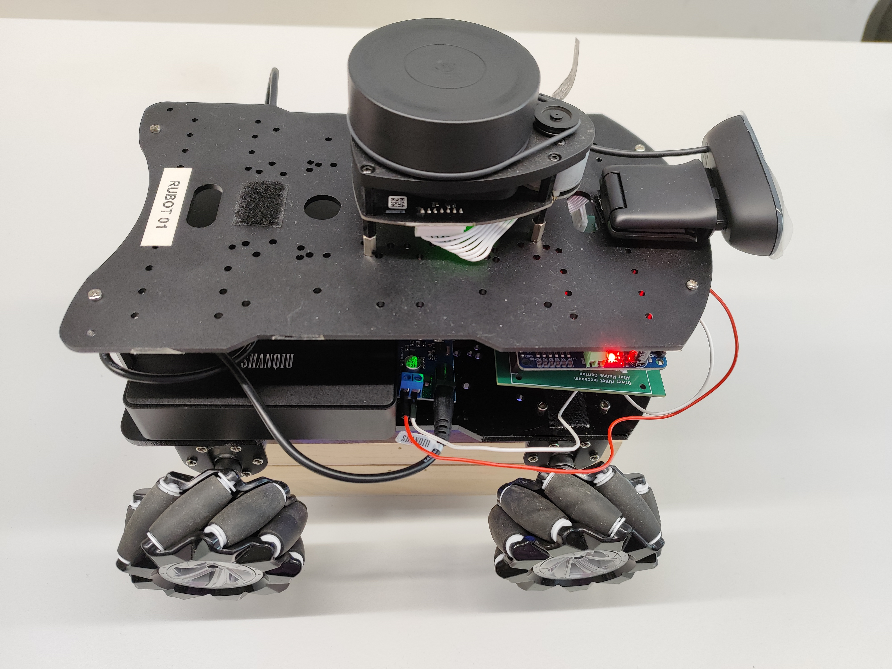
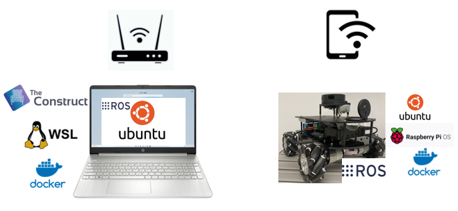
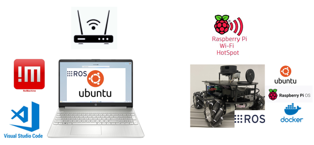

# **ROS environment setup**

The rUBot mecanum robot we will work is represented in the picture:

His main characteristics are: 

- RaspberryPi4 computer onboard control with Ubuntu20 and ROS Noetic
  - RPlidar distance sensor
  - usb camera sensor
- Arduino MEGA with shield for sensors & actuators control
  - Servomotor actuators for the 4 mecanum wheels
  


The main objectives of this chapter are:

- Setup the ROS environment to work with rUBot_mecanum_ws in simulation mode
- Connect the ROS environment with the real rUBot_mecanum

There are different possible solutions for the ROS environment in function of how the real robot is configured:

- If the **rUBot** is connected to a Public Network (recommended)
- If the **rUBot** starts a local hotspot

**Bibliography:**
- https://bitbucket.org/theconstructcore/workspace/projects/PS
- Arduino original program: https://blog.csdn.net/baidu_23831861/article/details/106938752

## **1. rUBot is connected to a Public Network**

When real rUBot is connected to a Public Nerwork we can connect to the real rUBot using:
  - TheConstruct ROS Environment (recommended)
  - WSL ROS environment
  - Docker ROS environment

  

### **2.1.1. TheConstruct ROS Environment (recommended)**

To **setup the repository** in your ROS environment, you need to:
- Fork my repository in your github account
- Open your ROS Noetic environment: https://app.theconstructsim.com/
- Clone your forked directory in your home directory
  ```shell
  cd /home/user
  git clone https://github.com/yourusername/rUBot_mecanum_ws
  cd rUBot_mecanum_ws
  catkin_make
  ```
- Open .bashrc file with VS Code (open file...)
- Ensure that you have the last 2 lines (review the exact name of your repository):
  ```shell
  source /opt/ros/noetic/setup.bash
  source /home/user/rUBot_mecanum_ws/devel/setup.bash
  ```
You are ready to work with your repository!

To **sync the repository** with the one in your github account, follow the instructions:
- Access to the TheConstruct environment local repository:
  ````shell
  cd /local repository path
  ````
- Update the local repository with possible changes in github origin repository
  ````shell
  git pull
  ````
- You can work with your local repository for the speciffic project session
- Once you have finished and you want to syncronize the changes you have made and update the github origin repository, type:
  ````shell
  git add .
  git commit -m "Message"
  git push
  ````
- You will have to specify the Username and Password (Personal Access Token you have generated)

To obtain the **PAT** in github follow the instructions:

- Log in to GitHub
- Go to Developer Settings
- Select Access Personal Access Tokens: Choose Tokens (classic)
- Click Generate new token (classic) and configure it:
  - Add a note to describe the purpose of the token, e.g., "ROS repo sync."
  - Set the expiration (e.g., 30 days, 60 days, or no expiration).
  - Under Scopes, select the permissions required:
    - For repository sync, you usually need: repo (full control of private repositories)
  - Click Generate token
- Once the token is generated, copy it immediately. You won't be able to see it again after leaving the page.

Your github origin repository has been updated!

To **connect your rUBot mecanum**  to the TheConstruct environment you have to configure your robot to be used in your ROSject. 

The **Instructor** will configure the rUBot:
- In the master **TheConstruct account**, we have to first Add a new robot:
  - Open the TheConstruct account and choose "Real Robots". Here you can add your robot.
  - Specify the name and the ROS version
  - Copy the "robot setup code line" used later to setup the robot to the TheConstruct environment

- In the **VScode terminal on rUBot-raspberrypi**:
  - It is better first to update and upgrade the ubuntu20
  - Paste the "robot setup code line". After some minutes the robot will be properly installed.
  - Run 'source ~/.bashrc' to re-export ROS variables before running roscore.
  - Bringup the robot. This will be done automatically every time the robot is swhitched on.

The **students** will be able to connect to specific real robot:
- Connect to the proper account: robotics.ub1@gmail.com
- In the **TheConstruct environment ROS_Noetic_course** from "my ROSjects": 
  - Select "Real robots", select the rUBot you have configured previously and "connect"
  - You can control the robot from the same TheConstruct environment you are using for simulation

The real rUBot is usually connectet to a public network with "robotics_ub" hotspot and the ROS environment is installed in a PC connected to a public network (the same "robotics_ub" or a different one).

### **2.1.2 WSL ROS environment**

Windows Subsystem for Linux is a good method to install a Linux Virtual Machine with ROS in a **windows PC**.

You will have to download and install Ubuntu from Microsoft store

You will have a **fast** and robust ROS environment in your windows PC

To properly work with WSL, use VScode with "Remote Explorer" extension installed:
- Open VS code and select "Remote Explorer"
- Select "WSL targets" and the "ubuntu20" 
- Connect to a new window
- Install ROS

To finish, in a VScode choose "Close remote connection"

You will be automatically disconnected from WSL Virtual machine.

To work with a **real rUBot**, connect your computer to the same Public Network your robot is connected to.

Using VS code with "Remote Explorer" extension installed:
- Open VS code and select "Remote Explorer"
- Select "WSL targets" and the "ubuntu20" 
- Connect to a new window

To control your real rUBot, you will have to specify that:

- The master is running in the rUBot board
- Your ROS environment is located in another PC

You will have to configure:
- The .bashrc from rUBot raspberrypi board with:
  ````shell
  export ROS_MASTER_URI=http://<raspberry_pi_ip>:11311
  export ROS_IP=<raspberry_pi_ip>
  ````
- The .bashrc from PC ROS environment with:
  ````shell
  export ROS_MASTER_URI=http://<raspberry_pi_ip>:11311
  export ROS_IP=<WSL2_ip>
  ````
Now you can control and view graphic windows with your PC under WSL ROS Virtual Machine! 

To finish, follow the steps:
- in a VScode rUBot terminal type:
  ````shell
  sudo poweroff
  ````
- in VS code choose "Close remote connection"

You will be automatically disconnected from VS code and after 1 minute, you can switch off the raspberryPi.

### **2.1.3. Using Docker ROS environment**

Docker is also a good option to install a ROS Virtual machine. This is compatible for Windows and MAC.

You will have to:
- Download and install Docker: https://docs.docker.com/desktop/setup/install/windows-install/
- All official Docker Images available are located in: [DockerHub](https://hub.docker.com/)
- Create a container with name, graphical display and Interactivelly type:
  ````shell
  docker run -it --name ros_noetic_desktop_rubot_container --env DISPLAY=host.docker.internal:0.0 --network=host --privileged ros_noetic_desktop_rubot /bin/bash
  ````
- Start XLaunch on your Windows PC for graphical interface and configure it with these settings:
    - Select "Multiple windows" or "One large window", depending on your preference.
    - Set Display number to 0 (default).
    - Enable "No Access Control" if you're having trouble connecting. This is less secure but helpful for initial setup and debugging.
    - Click Next and complete the setup.

- From VScode select Docker Extension and attach to the new running container and open folder in /root. 

You are now ready to work on your custom ROS container with graphical display!

To Exit the container:
- Close remote connection in VScode attached to Container
- In PC VScode terminal on container, type "exit"
- You can also user the Docker Extension to start and stop the container

To control the **real rUBot** you will have to connect your PC to the same Public Network your real rUBot is connected to.

You will have to specify that:

- The master is running in the rUBot board
- Your ROS environment is located in another PC

You will have to configure:
- The .bashrc from rUBot raspberrypi board with:
  ````shell
  export ROS_MASTER_URI=http://<raspberry_pi_ip>:11311
  export ROS_IP=<raspberry_pi_ip>
  ````
- The .bashrc from PC ROS environment with:
  ````shell
  export ROS_MASTER_URI=http://<raspberry_pi_ip>:11311
  export ROS_IP=<Docker_ip>
  ````
Now you can control and view graphic windows with your PC under Docker container!

## **2. rUBot starts a local hotspot**

When real rUBot starts a local hotspot, we can connect to the real rUBot using:
  - Remote Desktop
  - VScode with grahical interface



### **2.1 Remote Desktop**

To connect your PC to the Robot Hotspot, we have to select the rubot hotspot network:
  - SSID name: rubot_XX 
  - password "rUBot_Mec"

We will use Nomachine as a remote Desktop, select:
- IP address: 10.42.0.1
- user: ubuntu
- password: ubuntu1234

For a proper Display resolution in Nomachine, select: Display --> Change the size of remote screen

You will have the rUBot desktop on your windows nomachine screen

You are ready to work for the laboratory session!

### **2.2. VS code with graphical display**

To connect your computer to the robot using VS code with "Remote Explorer" extension installed:
- Open VS code and select "Remote Explorer"
- Add a new SSH connection as: "ssh -X ubuntu@10.42.0.1"
- Verify on ssh/settings "ForwardX11 yes" and "user ubuntu" 
- After connection specify the password as "ubuntu1234"

>Note: When you connect to your rUBot from another computer, you will have perhaps to regenerate the KEYS. In a new cmd on your PC, type the instuction and you will be able to connect with VScode:
````shell
ssh-keygen -R 10.42.0.1
````

You are now inside the rUBot_xx raspberrypi!

To finish, follow the steps:
- in a VScode rUBot terminal type:
````shell
sudo poweroff
````
- in VS code choose "Close remote connection"

You will be automatically disconnected from VS code and after 1 minute, you can switch off the raspberryPi.

**Graphical display**
To have graphical display we need:
- In your PC: Install Xlaunch
  - Download and install "Xming X Server for Windows" from: https://sourceforge.net/projects/xming/
  - Start XLaunch and in first window choose "Multiple windows" and Display "0"
  - in second window select "Start no client".
  - In the third window, ensure that "Disable access control" is selected (this allows your Raspberry Pi to connect).
  - Finish the setup and let XLaunch run in the background.
- Obtain the IP of your PC using "cmd" and type "ipconfig" (i.e. 10.42.0.78)
- In VScode raspberrypi4:
  - update and upgrade the raspberrypi ubuntu
  - Perhaps the firewall will block the connection, you have to create a new firewall rule:
    - Open the Windows Defender Firewall settings.
    - Go to Advanced Settings.
    - Create a new inbound rule:
      - Rule Type: Custom
      - Program: All programs
      - Protocol: TCP
      - Local Port: All ports
      - Remote IP Address: 10.42.0.0/24
      - Action: Allow the connection
      - Profile: Check only "Private" to allow traffic when connected to private networks.
  - reboot
  - Add to .bashrc file the lines: 
  ````shell
  export DISPLAY=10.42.0.78:0.0
  source /opt/ros/noetic/setup.bash
  source /home/ubuntu/Desktop/rUBot_mecanum_ws/devel/setup.bash
  ````

Graphical windows will be displayed in your PC Display!

