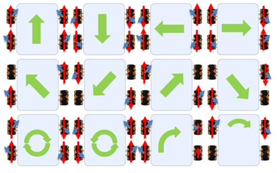
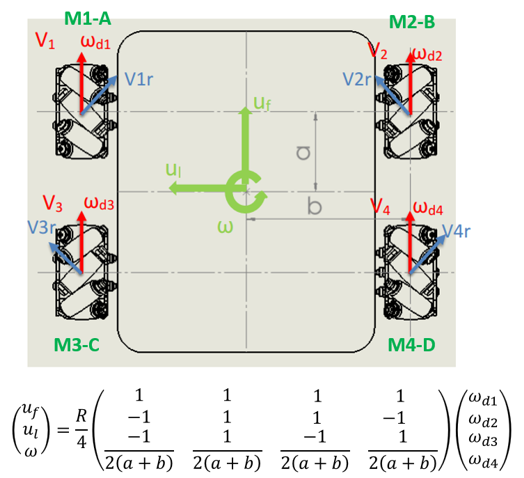
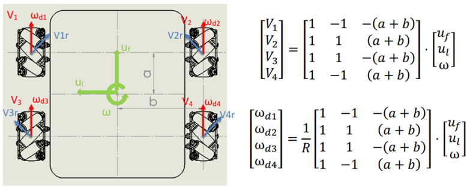
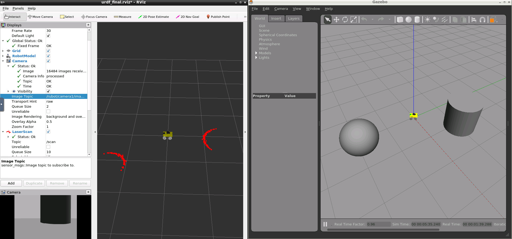
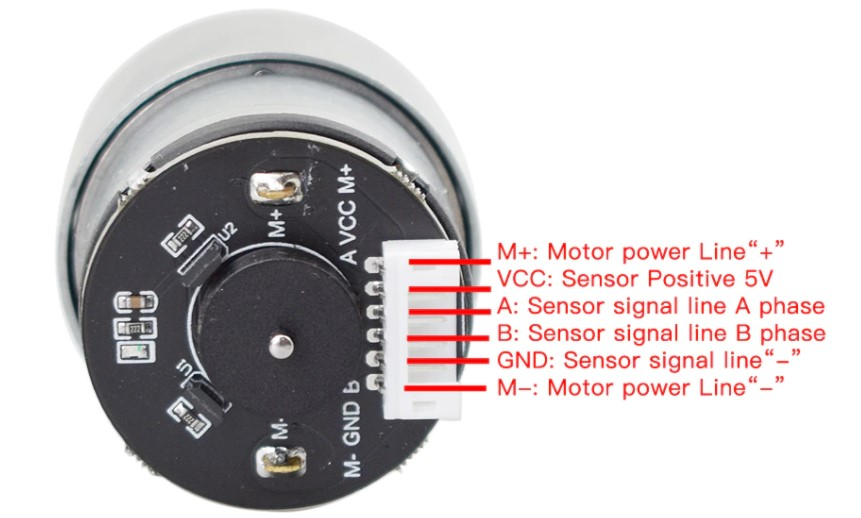
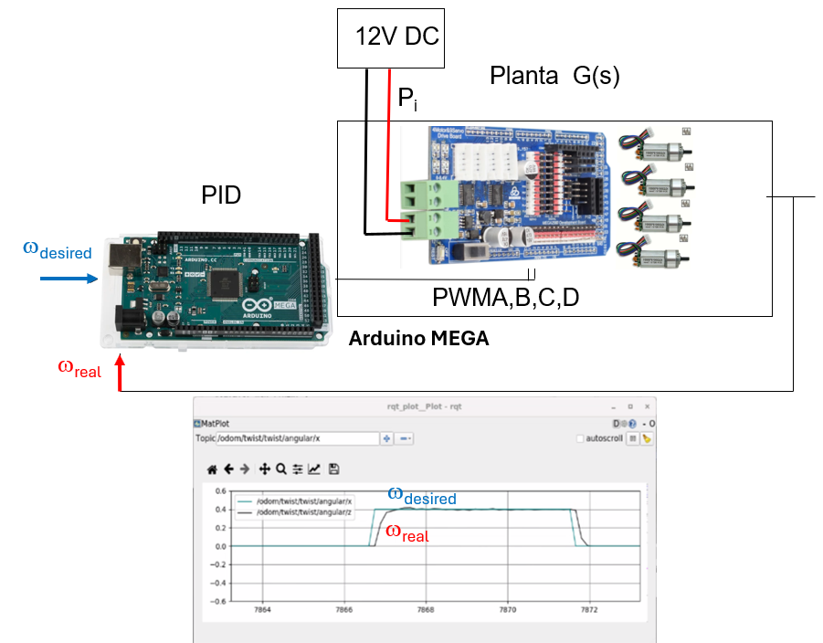
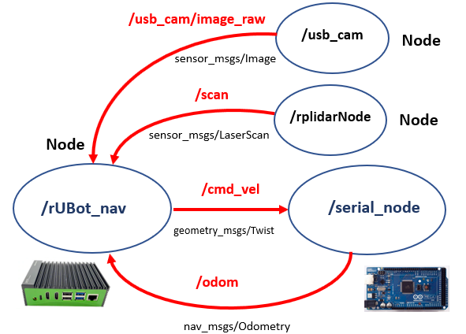

# **rUBot mecanum Bringup**

The objectives of this chapter are:
- Create a robot model of our rUBot mecanum
- Create a world model of the virtual environment
- Bringup the robot in virtual environment
- Bringup the real robot.

The rUBot mecanum robot we will work is represented in the picture:


**Bibliography:**
- https://bitbucket.org/theconstructcore/workspace/projects/PS

## **1. rUBot mecanum model generation**

First of all, we have created the "rubot_mecanum_description" package where we have created the rUBot model. 

In case you want to create it from scratch, type:
```shell
cd /home/user/rubot_mecanum_ws/src
catkin_create_pkg rubot_mecanum_description rospy
cd ..
catkin_make
```

### **1.1. Model design**

The geometrical definition of our rUBot is graphically described by:


The different elements (named **links**) are:
- base_link
- wheels
- camera
- base_scan

These elements are connected each-other by **joints**:
- base_link_joint
- wheel_joint
- joint_camera
- scan_joint


Some of these links have a speciffic **functionalities**:
- wheels: perform a robot movement according to a Mecanum-drive kinematics
- camera: view front images
- base_scan: detect obstacle distances in 360º around the robot

To create our robot model, we use **URDF files** (Unified Robot Description Format). URDF file is an XML format file for representing a robot model.(http://wiki.ros.org/urdf/Tutorials)

The general structure of a robot urdf model is based on:
- Links and joints: for the geometrical structure
- Gazebo plugins: for the functionalities

The urdf file structure is:
```xml
<?xml version="1.0" encoding="utf-8"?>
<robot name="rubot">
  <link name="base_link">
  ...
  </link>
  <joint name="base_link_joint" type="fixed">
  ...
  </joint>
  <gazebo>
    <plugin name="Mecanum_controller" filename="libgazebo_ros_planar_move.so">
    ...
    </plugin>
  </gazebo>
  <gazebo reference="upper_left_wheel">
  ...
  </gazebo>
</robot>
```

We have created 2 folders for model description:
- URDF: folder where different URDF models are located. In our case rubot.urdf
- meshes: folder where 3D body models in stl format are located. We will have rubot folder.

As we have explained above, main parts of URDF model are:
- links: diferent bodies/plastic elements
- joints: connection between 2 links 
- sensors & actuators plugins (2D camera, LIDAR and 4-wheels mecanum-drive)

The **link definition** contains:
- visual properties: the origin, geometry and material
- collision properties: the origin and geomnetry
- inertial properties: the origin, mass and inertia matrix

The **joint definition** contains:
- joint Type (fixed, continuous)
- parent and child frames
- origin frame
- rotation axis

In the case or upper left wheel link:
```xml
<!-- upper_left_wheel -->
  <link name="upper_left_wheel">
    <visual>
      <origin rpy="0 0 0" xyz="0 0 0"/>
      <geometry>
        <mesh filename="package://rubot_mecanum_description/meshes/rubot/upper_left_wheel.stl" scale="0.001 0.001 0.001"/>
      </geometry>
      <material name="light_grey"/>
    </visual>
    <collision>
      <origin rpy="-1.57 0 0" xyz="0 0 0"/>
      <geometry>
        <cylinder length="0.03" radius="0.05"/>
      </geometry>
    </collision>
    <inertial>
      <origin rpy="-1.57 0 0" xyz="0.0 0.0 0.0"/>
      <mass value="0.2"/>
      <inertia ixx="0.000166" ixy="0" ixz="0" iyy="0.000303" iyz="0" izz="0.000166"/>
    </inertial>
  </link>
  <joint name="upper_left_wheel_joint" type="continuous">
    <origin rpy="0 0 0" xyz="0.07 0.1 0"/>
    <parent link="base_link"/>
    <child link="upper_left_wheel"/>
    <axis xyz="0 1 0"/>
  </joint>
```
> Be careful with base_link:
>
> The inertia matrix can be analytically calculated with the mas and geometry. Be sure the mass is consistent and the inertia Ixx,Iyy and Izz are high enough to avoid underired drift movements. Consider the Inertia matrix you can generate using the **urdf_inertial_calculator.py** program file you have in "Documentation/files/Doc/Robot_Models/URDF_inertial".

The rUBot model includes different **sensors and actuators**:

The full model contains also information about the sensor and actuator controllers using specific **Gazebo plugins** (http://gazebosim.org/tutorials?tut=ros_gzplugins#Tutorial:UsingGazebopluginswithROS). 

Gazebo plugins give your URDF models greater functionality and compatiblility with ROS messages and service calls for sensor output and motor input. 

These plugins can be referenced through a URDF file, and to insert them in the URDF file, you have to follow the sintax:

**2D-camera Sensor**:

The two-dimensional camera sensor corresponds to the USB real camera. 

This camera obtains 2D images in the front and is simulated in URDF model as:
- link with the visual, collision and inertial properties
- joint of fixed type
- Gazebo plugin as a sort of "driver" to simulate the real behaviour

Review the joint and link definition in URDF model.

The used Gazebo plugin is:

```xml
  <!-- 2D Camera controller -->
  <gazebo reference="camera">
    <sensor name="camera1" type="camera">
      <update_rate>30.0</update_rate>
      <camera name="front">
        <horizontal_fov>1.3962634</horizontal_fov>
        <image>
          <width>800</width>
          <height>800</height>
          <format>R8G8B8</format>
        </image>
        <clip>
          <near>0.02</near>
          <far>300</far>
        </clip>
      </camera>
      <plugin filename="libgazebo_ros_camera.so" name="camera_controller">
        <alwaysOn>true</alwaysOn>
        <visualize>true</visualize>
        <cameraName>rubot/camera1</cameraName>
        <imageTopicName>image_raw</imageTopicName>
        <cameraInfoTopicName>camera_info</cameraInfoTopicName>
        <frameName>camera</frameName>
        <hackBaseline>0.07</hackBaseline>
        <distortionK1>0.0</distortionK1>
        <distortionK2>0.0</distortionK2>
        <distortionK3>0.0</distortionK3>
        <distortionT1>0.0</distortionT1>
        <distortionT2>0.0</distortionT2>
      </plugin>
    </sensor>
  </gazebo>
  ```
>To view the camera image you can:
> - add the line in the plugin 
> ```xml
><visualize>true</visualize>"
> ```
> - use rviz
> - type rqt in a terminal and select Plugins->Visualization->Image View
>
>Alternativelly with false in plugin, you can allways call the image typing in a new terminal:
>```shell
>rqt image view
>```

**RPlidar sensor**

A Lidar sensors is  device that is able to measure the obstacle distances at 360º around the robot. 

He is sending 720 laser beams (2 beams/degree) and measures the distance each laser beam finds an obstacle. He is able to measure from 12cm to 10m. The used Lidar sensor is a 360º RPLidar A1M8 (https://www.robotshop.com/es/es/rplidar-a1m8-kit-desarrollo-escaner-laser-360-grados.html)

This lidar is simulated in URDF model as:
- link with the visual, collision and inertial properties
- joint of fixed type
- Gazebo plugin as a sort of "driver" to simulate the real behaviour

 Review the joint and link definition in URDF model.
> Note that rpLIDAR is mounted at 180º and you need to turn the link model and the joint to reflect this in the URDF model.


The gazebo plugin we have used is:
```xml
  <!-- Laser Distance Sensor RPLIDAR controller-->
  <gazebo reference="base_scan">
    <sensor name="lds_lfcd_sensor" type="ray">
      <pose>0 0 0 0 0 0</pose>
      <visualize>true</visualize>
      <update_rate>5</update_rate>
      <ray>
        <scan>
          <horizontal>
            <samples>720</samples>
            <resolution>1</resolution>
            <min_angle>0.0</min_angle>
            <max_angle>6.28319</max_angle>
          </horizontal>
        </scan>
        <range>
          <min>0.12</min>
          <max>10</max>
          <resolution>0.015</resolution>
        </range>
        <noise>
          <type>gaussian</type>
          <!-- Noise parameters based on published spec for YDLIDAR X4
              is 1.5% at half range 4m (= 60mm, "+-160mm" accuracy at max. range 8m).
              A mean of 0.0m and stddev of 0.020m will put 99.7% of samples
              within 0.16m of the true reading. -->
          <mean>0.0</mean>
          <stddev>0.02</stddev>
        </noise>
      </ray>
      <plugin filename="libgazebo_ros_laser.so" name="gazebo_ros_lds_lfcd_controller">
        <!-- topicName>/gopigo/scan</topicName -->
        <topicName>scan</topicName>
        <frameName>base_scan</frameName>
      </plugin>
    </sensor>
  </gazebo>
```
>To view the LIDAR rays be sure to add 
> ```xml
><visualize>true</visualize>"
> ```
> or use rviz

It is important to note that:
- the number of points of real RPLidar depends on Lidar model (you will need tot test it first)
- the number of points of simulated Lidar is selected to 720

**Actuator**:

The rUBot_mecanum contains a "Mecanum drive actuator" based on:
- 4 wheels driven by a DC servomotor 
- with speciffic Kinematic control 
- able to move the robot in x and y directions
- and able to obtain the Odometry information

Each of the 4 wheels have speciffic:
- link with the visual, collision and inertial properties
- joint of continuous type
- Gazebo plugin as a sort of "driver" to simulate the Kinematics of our rUBot_mecanum.

The **rUBot_mecanum kinematics** describes the relationship between the robot wheel speeds and the robot velocity. We have to distinguish:
- **Forward kinematics**: obtains the robot velocity (linear and angular in /cmd_vel) and POSE (odometry) for speciffic robot wheel speeds
- **Inverse kinematics**: obtains the robot wheels speeds for a desired robot velocity (linear and angular in /cmd_vel)

The different movements the Mecanum robot is able to perform are:



The forward kinematics is described by:



The inverse kinematics is described by:



The Odometry calculation is obtained by:


This kinematics and odometry calculations are described in the "libgazebo_ros_planar_move.so" file and the URDF model will contain the specific gazebo plugin.

This driver is the "Planar Move Plugin" and is described in Gazebo tutorials: http://gazebosim.org/tutorials?tut=ros_gzplugins#AddingaModelPlugin

```xml
  <!-- Mecanum drive controller -->
  <gazebo>
    <plugin name="Mecanum_controller" filename="libgazebo_ros_planar_move.so">
      <commandTopic>cmd_vel</commandTopic>
      <odometryTopic>odom</odometryTopic>
      <odometryFrame>odom</odometryFrame>
      <odometryRate>50.0</odometryRate>
      <robotBaseFrame>base_footprint</robotBaseFrame>
    </plugin>
  </gazebo>
  ```

### **1.2. ROS visualization Tools**

ROS has two powerfull visualization tools:
- RVIZ: used to visualize the robot model and the messages published in the different topics
- Gazebo: is a physical simulator 

**RVIZ**

We will first use RVIZ to check that the model is properly built. 

RViz only represents the robot visual features. You have available all the options to check every aspect of the appearance of the model.

We use a specific "display.launch" launch file where we specify the robot model we want to open in rviz with a configuration specified in "urdf.rviz":
```xml
<launch>
  <param name="robot_description" textfile="$(find rubot_mecanum_description)/urdf/rubot.urdf" />
  <node name="joint_state_publisher" pkg="joint_state_publisher" type="joint_state_publisher" />

  <node name="robot_state_publisher" pkg="robot_state_publisher" type="robot_state_publisher" />
  <node name="rviz" pkg="rviz" type="rviz" args="-d $(find rubot_mecanum_description)/rviz/urdf_final.rviz" />
</launch>
```
```shell
roslaunch rubot_mecanum_description display.launch
```


> Colors in rviz: 
>- are defined at the beginning
>- Ensure the "visual" link properties have color "name"
```xml
<robot name="rubot">
  <material name="yellow">
    <color rgba="0.8 0.8 0.0 1.0"/>
  </material>

  ...

    <link name="base_link">
    <visual>
      <origin rpy="0 0 0" xyz="0 0 0"/>
      <geometry>
        <mesh filename="package://rubot_mecanum_description/meshes/rubot/base_link.stl" scale="0.001 0.001 0.001"/>
      </geometry>
      <material name="yellow"/>
    </visual>
```
**Gazebo**

In robotics research, always before working with a real robot, we simulate the robot behaviour in a virtual environment close to the real one. **Gazebo** is an open source 3D robotics simulator and includes an ODE physics engine and OpenGL rendering, and supports code integration for closed-loop control in robot drives. This is sensor simulation and actuator control.

We will create a new rubot_gazebo.launch file to spawn the robot in an empty world:
```xml
<launch>
  <!-- Define the needed parameters -->
  <arg name="model" default="rubot.urdf" />

  <include file="$(find gazebo_ros)/launch/empty_world.launch"/>
  <!-- Spawn the robot -->
  <!-- Robot URDF definition -->
    <param name="robot_description" textfile="$(find rubot_mecanum_description)/urdf/$(arg model)"/>
  <node name="spawn_model" pkg="gazebo_ros" type="spawn_model"
    args="-urdf -model rUBot -param robot_description"/>
</launch>
```
Open a new terminal and launch this file:
```shell
roslaunch rubot_mecanum_description rubot_gazebo.launch
roslaunch rubot_mecanum_description display.launch
```


You will see in Rviz the camera is receiving now images!
> Colors in gazebo: 
>- are defined at the end of urdf file:
```xml
<!-- Gazebo colors have to be specified here with predefined Gazebo colors -->
  <gazebo reference="base_link">
    <material>Gazebo/Yellow</material>
  </gazebo>
```
You can create a very **simple world** "rubot.world" using gazebo:

- Maintain the Gazebo and RVIZ screens opened
- add some objects in the empty world

Now in RVIZ you will see the objects with the USB camera and Lidar



You can see the nodes and topics generated using rqt_graph


> To see the frames you have to add TF in rviz

>Carefull:
- Perhaps is needed to setup your Keys again:
  ```shell
  curl -s https://raw.githubusercontent.com/ros/rosdistro/master/ros.asc | sudo apt-key add -
  sudo apt get update
  sudo apt get upgrade
  ```
- To close the Gazebo is better to type in a new terminal:
  ```shell
  pkill gzserver && pkill gzclient
  ```

## **2. Design the project world**

Here we have first to design the project world, for exemple a maze from where our rUBot mecanum has to navigate autonomously.

There is a very useful and simple tool to design a proper world: "**Building editor**" in gazebo.

Open gazebo as superuser:
```shell
sudo gazebo
```

You can build your world using "Building Editor" in Edit menu


- Save the generated model in a model folder (without extension)
- Close the Builder Editor, modify the model position and add other models to configure your virtual desired world.
- Save the generated world (with extension .world) in the world folder.

Once you finish is better to close the terminal you have work as superuser

#### ***Modify a created world***
- Open a terminal where you have the world you want to modify
- type: sudo gazebo ./test.world (or simply "gazebo test.world")
- make modifications: add some other models, delete previously added models, etc.
- save your world in a world directory
- close gazebo and the terminal
#### **Create world with model parts**
You can create model parts like walls of 60cm or 90cm or 120cm with a geometry and color, using building editor. These parts can be saved:
- in ~/.gazebo/models/ (this is the default folder)
- in speciffic folder in your package (i.e. rUBot_mecanum_ws/src/rubot_mecanum_description/models). In this case, to add the path in Gazebo, add this line in .bashrc file:
  ```xml
  export GAZEBO_MODEL_PATH=/home/user/rUBot_mecanum_ws/src/rubot_mecanum_description/models:$GAZEBO_MODEL_PATH
  ```
- When a model is created with "Building Editor", this path is saved in gazebo environment and you can use it in the future.
- You can allways select "Add folder path" in "insert" gazebo menu tab, and select the models folder you have created in your project ws 

You will have acces in gazebo insert section. Then you can construct your world adding parts.

This is an exemple:


## **3. Bringup the rUBot in Virtual environment**

The first step in robotics is to bringup the rUBot mecanum robot in our generated virtual world. This means:
- Open Gazebo with the designed virtual world
- spawn our robot in the designed virtual world 
- and open Rviz to see the topic messages.

This is defined in "rubot_bringup_sw.launch" file. 
``` shell
roslaunch rubot_mecanum_description rubot_bringup_sw.launch
```


>Careful:
- we have included in launch file: gazebo rubot spawn and rviz visualization 
- Verify in rviz you have in fixed frame the "odom" frame

Now we are ready to control our robot in this virtual environment!

**Activity 3: rUBot Bringup SW**

The objective of this activity is to spawn our custom rUBot in a virtual world.

You will have to:
- Design a custom rUBot model corresponding to the real rUBot_mecanum (rubot_custom.urdf), with:
  - Customized model colors (rviz and gazebo)
  - Add a 3D-part on top with a fixed joint
  - Modify the "base_scan" link and joint to take into account the lidar orientation in our robot
- Design a custom virtual world using the wooden model parts

To verify the final bringup, create a new "rubot_bringup_sw_custom.launch" file with your rubot_custom.urdf and the world you have created:
```shell
roslaunch rubot_mecanum_description rubot_bringup_sw_custom.launch
```


Upload a zip file with:
- Picture with gazebo and rviz obtained with your custom rubot model and designed world
- file: "rubot_custom.urdf"
- file: "rubot_bringup_sw_custom.launch"


## **4. Bringup the real robot**

The rUBot Mecanum real hardware is based on:
- Robot base structure with 4 Mecanum wheels driven by DC-servomotors
- 2D-Camera to generate front images
- Lidar for Navigation with obstacle avoidance
- Arduino Mega with custom Shield: to control the 4 Mecanum Wheels (and other sensors onboard in function of the application)
- Rock5b Computer on-board: for high level control in ROS environment. He will also control directly the usb-camera and the Lidar.

To Bingup our real robot we have to:
 
- Launch the "Mecanum-drive control" module for servomotor actuators for the 4 mecanum wheels
- Launch the RPlidar distance sensor
- Launch the usb camera sensor


### **4.1. Launch the "Mecanum-drive control" module**

The 4 mecanum wheels will be controlled by the Arduino board. 

The Arduino is great tool for quickly and easily programming hardware. You can integrate ROS in Arduino hardware with:
- the **rosserial_arduino package**: to use ROS directly with the Arduino IDE.
- the **rosserial package**: to provide a ROS communication protocol that works over your Arduino's UART. It allows your Arduino to create a ROS node which can directly publish and subscribe to ROS messages, publish TF transforms, and get the ROS system time.

You can install rosserial for Arduino by running:
```shell
sudo apt-get install ros-noetic-rosserial-arduino
sudo apt-get install ros-noetic-rosserial
```
Once you have installed Arduino IDE, you can install the ROS libraries with:
```shell
cd <sketchbook>/libraries
rm -rf ros_lib
rosrun rosserial_arduino make_libraries.py .
```
We have created a custom Arduino program for rubot_mecanum robot. This program is able to:
- Communicate with ROS environment to subscribe to the topic **/cmd_vel** the desired rUBot movement
- Apply the kinematics of the Mecanum robot to control the 4 mecanum wheels 
- Read the encoders to calculate the odometry
- Communicate with ROS environment to publish to the topic **/odom** the odometry in real-time
- Interface with all the other sensors/actuators connected to arduino-mega board

The "**rUBot_drive.ino**" arduino program is located on /Documentation/files/arduino/ folder

Let's see some important characteristics:
- You need to install Encoder.h lib: https://www.arduino.cc/reference/en/libraries/encoder/
- Verify the Motor connections order



- Verify the Shield schematics for the A,B,C,D bus-connectors


- Verify the Pin number of encoders, PWM and DIR in config.h and encoder.h files


- We need to increase the buffer size of /odom publisher because the Arduino MEGA Buffer size for messages is 512bits (not enough for Odometry messages). To perform this modification, in **ROS.h** file from the Arduino library you have to add (at the end in else case section):
  ```python
  #else
  //typedef NodeHandle_<ArduinoHardware> NodeHandle; // default 25, 25, 512, 512
  typedef NodeHandle_<ArduinoHardware, 5, 5, 1024, 1024> NodeHandle;
  #endif
  ```
  > In older versions the syntax was:
  >
  >typedef NodeHandle_<ArduinoHardware, 5, 5, 1024, 1024, FlashReadOutBuffer_> NodeHandle;
- The default baudrate to communicate with Arduino board is 47600. I suggest to maintain the Baudrate to 57600!
  >
  >In some cases is necessary to increase it. To increase this baudrate you need in **ArduinoHardware.h** file from the Arduino >library to change this default baudrate:
  ```python
  class ArduinoHardware {
    public:
      ArduinoHardware(SERIAL_CLASS* io , long baud= 57600){
      //ArduinoHardware(SERIAL_CLASS* io , long baud= 115200){
        iostream = io;
        baud_ = baud;
      }
      ArduinoHardware()
      {
  #if defined(USBCON) and !(defined(USE_USBCON))
        /* Leonardo support */
        iostream = &Serial1;
  #elif defined(USE_TEENSY_HW_SERIAL) or defined(USE_STM32_HW_SERIAL)
        iostream = &Serial1;
  #else
        iostream = &Serial;
  #endif
        baud_ = 57600;
        //baud_ = 115200;
      }
  ```
  > Important!: This changes have to be made in the library files where Arduino is installed (usually in /home/arduino/libraries). This can be found when in arduino IDLE we go to settings to see the Exemples folder.

Let's **upload the Arduino program: rUBot_drive_mpuig.ino** (there is a number version):
- with filesystem manager go to Documentation/files/Arduino folder
- Select the last program version and uncompress the file in the same folder
- Open the main program rUBot_drive_mpuig.ino
- verify the board is Arduino Mega and port tty/ACM0
- upload the program to arduino board (any ROS bringup previous execution has to be closed!)

When we power the arduino board, this program starts and a new node appears in the ROS environment. To test its behaviour we have to run:
```xml
roscore
rosrun rosserial_python serial_node.py _port:=/dev/ttyACM0 _baud:=57600
rostopic pub -r 10 /cmd_vel geometry_msgs/Twist '[0.5, 0, 0]' '[0, 0, 0]'
```
> the port to which the Arduino is connected,is usually /dev/ttyACM0. Change it if you have another one.

> The last command sends a Twist message to the robot. The wheels should be moving forward. You can try different movements by modifying the numbers inside the brackets: '[vx, vy, vz]' '[wx, wy, wz]'

Graphically we have designed a **Closed loop PID CD-motor speed control**:



Each wheel is turning at a precise speed defined by the inverse kinematics. The speed dynamics and steady state value is ensured by the designed PID closed loop.

### **4.2. Launch LIDAR node**

The rpLidar sensor is directly connected to the USB port of Rock5b board.
To launch the rpLIDAR sensor, connect the LIDAR sensor to rock5b and execute:
```shell
roslaunch rubot_mecanum_description rplidar_rock.launch
```
Verify:
- the port to: /dev/ttyUSB0
- the frame_id to: base_scan

### **4.3. Launch usb_cam node**
The usb-camera sensor is directly connected to the USB port of Rock5b board. We have created a speciffic launch file to open properly the camera
To launch the raspicam sensor, execute:
```shell
roslaunch rubot_mecanum_description usb_cam_rock.launch
```
Verify:
- the video_device param to: "/dev/video1"
- the camera_frame_id param to: "usb_cam"
- the topic to subscribe to the image data:
  ```shell
  <remap from="image" to="/usb_cam/image_raw"/>
  ```
  > This is in case you want to open "Image View". By default is not activated (commented)

### **Final bringup launch file**

We will create a "rubot_bringup_hw_rock.launch" file to setup the rUBot_mecanum.

>Important!: Change the **"rubot_custom.urdf"** as the model name according to the robot model you have designed in the previous activity.

To launch the bringup file type:
```shell
roslaunch rubot_mecanum_description rubot_bringup_hw_rock.launch
```
Graphically we have this structure:




### **Lab Activity 1: rUBot bringup HW**

The objective of this session is to understand the diferent nodes we have to launch to bringup our robot and verify the working performances.
- Verify the nodes and topics 
- verify the Camera images
- Verify the Lidar performances
- Verify the arduino node

Have you something that is not working as you expected?

Upload the following:
- Picture of the RVIZ screen obtained
- Picture with the nodes and topics obtained with the instruction rqt_graph

### **Lab Activity 2: Lidar test and final bringup HW**

The objectives of this activity are:
- Final bringup file:
  - Launch the **rubot_bringup_hw_rock.launch** with the previously created **rubot_custom.urdf** file.
  - In RVIZ, verify the position of the obstacles around the robot. Are them in the correct orientation? 
  - create another **rplidar_rock_custom.launch** file and modify the Lidar reference-frame to the appropiate frame to see the obstacles in the correct orientation.
 - Create a new **rubot_bringup_hw_rock_custom.launch** file containing:
    - rubot_custom.urdf final model
    - rplidar_rock_custom.launch final file
- Lidar test:
  - Put your robot inside a real world and launch the **rubot_bringup_hw_rock_custom.launch** file
  - Launch the rubot_lidar_test.launch file and verify the number of laser beams. Create a new **rubot_lidar_test_custom.launch** and **rubot_lidar_test_custom.py**, including a laser_factor variable as beams/deg.

Upload a zip file including:
- picture of rviz screen where you can see the lidar distances
- the rubot_lidar_test_custom.py, 
- rubot_custom.urdf, 
- rplidar_rock_custom.launch, 
- rubot_bringup_hw_rock_custom.launch 

