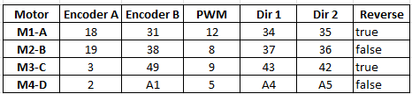
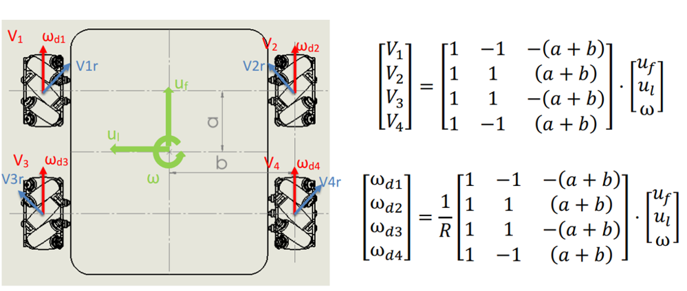
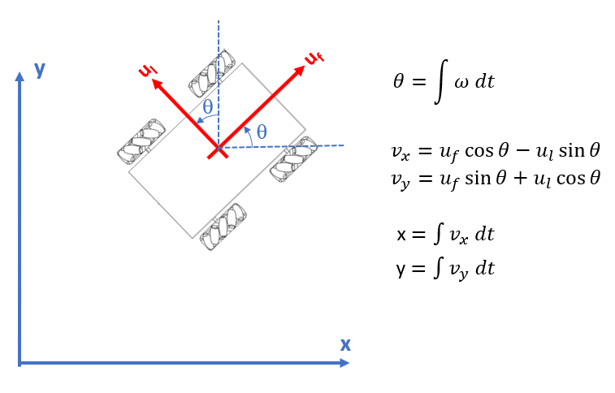

# **rUBot Mecanum Hardware bringup**
The hardware bringup file will contain:
- launch the rUBot node in Arduino-Mega board
- launch the LIDAR node
- launch the usb_cam node

Graphically, the final node structure will be:


The bringup launch file will prepare the rUBot to comunicate with /rUBot_nav node for specific control actions.

## **1. Launch rUBot node**

To bringup we need to run the driver designed for rubot_mecanum robot. The driver is in fact an arduino program that controls:

- The kinematics of the 4 mecanum wheels to apply the twist message in /cmd_vel topic
- The encoders to obtain the odometry
- Read the LIDAR and USB-Camera
- interface with all the other sensors/actuators connected to arduino-mega board

The "rubot_mecanum.ino" arduino program is located on /Documentation/files/arduino/ folder

>Carefull!:
>
>You need to install Encoder.h lib: https://www.arduino.cc/reference/en/libraries/encoder/

This final code contains:
- Subscriber to /cmd_vel topic 
- Publisher to /odom topic

>Take care about:
>- Motor connections


>- Shield schematics


>- Pin number of encoders, PWM and DIR in config.h and encoder.h files



>- Inverse Kinematics expressions in kinematics.hpp library according to:

The kinematics.hpp has to include the correct expressions:
```python
//wABCD m/s
void InverseKinematic(float vx,float vy,float omega, float &pwmA,float &pwmB,float &pwmC,float &pwmD){
  pwmA=speed2pwm((vx-vy-K*omega)); 
  pwmB=speed2pwm(vx+vy+K*omega); 
  pwmC=speed2pwm(vx+vy-K*omega);
  pwmD=speed2pwm(vx-vy+K*omega); 
```
>- The Odometry expression is calculated according to:

> This is implemented in the main loop of arduino program:
```python
void loop(){
  float ax,ay,az,gx,gy,gz;
  delay(10);
  float vxi=0,vyi=0,omegai=0;
  ForwardKinematic(wA,wB,wC,wD,vxi,vyi,omegai);
  float dt=PIDA.getDeltaT();
  x+=vxi*cos(theta)*dt-vyi*sin(theta)*dt;
  y+=vxi*sin(theta)*dt+vyi*cos(theta)*dt;
  theta+=omegai*dt;
  if(theta > 3.14)
    theta=-3.14;
```

> Increase the /odom publisher buffer size:
> - We need to increase the buffer size of /odom publisher because the Arduino MEGA Buffer size for messages is 512bits (not enough for Odometry messages). To perform this modification, in **ROS.h** file from the Arduino library you have to add (at the end in else case section):
  ```python
  #else

    //typedef NodeHandle_<ArduinoHardware, 25, 25, 512, 512, FlashReadOutBuffer_> NodeHandle;
    typedef NodeHandle_<ArduinoHardware, 5, 5, 1024, 1024, FlashReadOutBuffer_> NodeHandle;

  #endif  
  ```

> Increase the communication baudrate:
> - The default baudrate to communicate with Arduino board is 57600. I suggest to maintain the Baudrate to 57600!
>
>In some cases is necessary to increase it. To increase this baudrate you need in **ArduinoHardware.h** file from the Arduino >library to change this default baudrate:
```python
class ArduinoHardware {
  public:
    //ArduinoHardware(SERIAL_CLASS* io , long baud= 57600){
    ArduinoHardware(SERIAL_CLASS* io , long baud= 115200){
      iostream = io;
      baud_ = baud;
    }
    ArduinoHardware()
    {
#if defined(USBCON) and !(defined(USE_USBCON))
      /* Leonardo support */
      iostream = &Serial1;
#elif defined(USE_TEENSY_HW_SERIAL) or defined(USE_STM32_HW_SERIAL)
      iostream = &Serial1;
#else
      iostream = &Serial;
#endif
      //baud_ = 57600;
      baud_ = 115200;
    }
```

To **test your rubot_mecanum arduino program** you need to:
- open arduino IDE
- upload the rubot_mecanum.ino file
- Open 3 new terminals and type:
```shell
roscore
rosrun rosserial_python serial_node.py _port:=/dev/arduino _baud:=57600
rostopic pub -r 10 /cmd_vel geometry_msgs/Twist '[0.5, 0, 0]' '[0, 0, 0]'
```
> /dev/arduino is the port to which the Arduino is connected, change it in case yours is different (usually /dev/ttyACM0)

> The last command sends a Twist message to the robot. The wheels should be moving forward. You can try different movements by modifying the numbers inside the brackets: '[vx, vy, vz]' '[wx, wy, wz]', you should only change vx, vy and wz values as the others do not apply. As it is an holonomic robot, if all the values are 0.0 except for wz (angular velocity in z axis) you will obtain a movement in which the robot spins on itself.

## **2. Launch LIDAR node**

To launch the rpLIDAR sensor, connect the LIDAR sensor to rock5b and execute:
```shell
roslaunch rubot_mecanum_description rplidar_rock.launch
```
Verify:
- the port to: /dev/ttyUSB0
- the frame_id to: base_scan

## **3. Launch usb_cam node**
We have created a speciffic launch file to open properly the camera
To launch the raspicam sensor, execute:
```shell
roslaunch rubot_mecanum_description usb_cam_rock.launch
```
Verify:
- the video_device param to: "/dev/video1"
- the camera_frame_id param to: "usb_cam"
- the topic to subscribe to the image data:
  ```shell
  <remap from="image" to="/usb_cam/image_raw"/>
  ```

## **Final bringup launch file**

We will create a "rubot_bringup_hw_rock.launch" file to setup the rUBot_mecanum.

To launch the bringup file type:
```shell
roslaunch rubot_mecanum_description rubot_bringup_hw_rock.launch
```
# **Firsts tests**
The firsts tests we can do are:
- Image view in rviz
- lidar ranges
- Kinematics: wheels movement for desired direction
- odometry values
- DC motor linear velocity and position

## **1. Image view**

To view the image is better to use:
```shell
rqt_image_view
```
> This is usually done in the bringup file

## **2. Lidar reference frame and ranges**
the LIDAR reference-frame is by default "base_scan". When using rplidar mounted back-side, in that case review the urdf model and be sure the "base_scan" frame is looking to the front. If not, you have to change the reference-frame to "odom" frame to see the obstacles in the right orientation. You have to open the "rplidar.launch" file and change the line:
```xml
<param name="frame_id" type="string" value="base_scan"/>
```
to the param value:
```xml
<param name="frame_id" type="string" value="odom"/>
```
Once you have made the bringup, verify in RVIZ that the obstacles detected by laser beams are in the correct orientation!

In function of lidar module, there are 720 or more laser beams.
We have created a "rubot_lidar_test.launch" file to test the number of laser beams and its position.
```shell
roslaunch rubot_control rubot_lidar_test.launch
```

## **3. Kinematics**
First verification is the forward kinematics. You need to verify the arduino program in terms of the control of wheel rotation for desired (uf, ul,w).

To test your rubot_mecanum arduino program you need to:
- open arduino IDE
- upload the rubot_mecanum.ino file
- Open 3 new terminals and type (change values for different direction of movement):
```shell
roscore
rosrun rosserial_python serial_node.py _port:=/dev/ttyACM0 _baud:=57600
rostopic pub -r 10 /cmd_vel geometry_msgs/Twist '[0.5, 0, 0]' '[0, 0, 0]'
```
