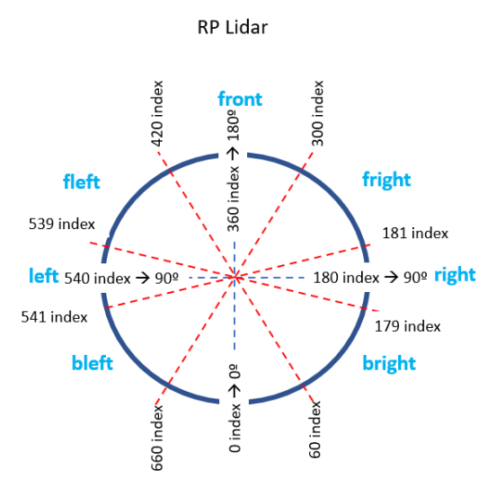

# **rUBot mecanum navigation control**

The objectives of this chapter are:
- Navigation control in virtual environment 
- Navigation control with real rUBot


The final model represents the real rUBot we will use in the laboratory

The rUBot mecanum robot we will work is represented in the picture:


**Bibliography:**
- https://bitbucket.org/theconstructcore/workspace/projects/PS


## **1. rUBot mecanum navigation control in virtual environment**

Once the world has been generated we will create a ROS Package "rubot_control" to perform the navigation control nodes
```shell
cd ~/rubot_mecanum_ws/src
catkin_create_pkg rubot_control rospy std_msgs sensor_msgs geometry_msgs nav_msgs
cd ..
catkin_make
```

### **3.1 Kinematics model of mecanum robot**
The first concept we are going to see is kinematic models. 

Wheeled mobile robots may be classified in two major categories, holonomic (omnidirectional) and nonholonomic. 
- **Nonholonomic mobile robots**, such as conventional cars, employ conventional wheels, which prevents cars from moving directly sideways.
- **Holonomic mobile robots**, such as mecanum cars, employ omni or mecanum wheels, which allow lateral and diagonal movements

We will define the Kinematic model for Holonomic Mecanum wheeled robot:

Omnidirectional wheeled mobile robots typically employ either omni wheels or mecanum wheels, which are typical wheels augmented with rollers on their outer circumference. These rollers spin freely and they allow sideways sliding while the wheel drives forward or backward without slip in that direction.

The **different movements** our car can perform are:


The **forces** involved define the robot linear and angular movement:


The **Forward Kinematics** equations are defined below:


where

- Vi: Linear speed of the wheels.
- ωdi: Angular speed of the wheels.
- Vir: Tangential speed of the rollers.
- ul: Linear velocity of the system on the X axis.
- uf: Linear velocity of the system on the Y axis.
- ω: Speed of rotation of the system on the Z axis.
- a: Distance from the center of the robot to the axis of rotation of the wheel.
- b: Distance from the center of the robot to the center of the width of the wheel.

>(see [Lynch & Park, 2017] for a complete derivation of this model).

In the **Inverse Kinematics** we want to apply a robot movement defined by:
- a linear and angular velocity using a Twist message type published in a /cmd_vel topic. 
- we need to calculate the 4 wheel speeds needed to obtain this robot velocity

This is defined by the following expressions:

To obtain the **Odometry** we use the information of (uf,ul,w) and Gazebo plugin calculates the POSE of our robot.

The analytical expressions are explained graphically in the picture:


In the case of real mecanum robot this is calculated by the robot driver as an arduino program in arduino-mega platform.

### **3.2. Mecanum control in a world environment**
We can control the movement of our robot using:
- the keyboard or a joypad
- pragramatically in python creating a "/rubot_nav" node

We are now ready to launch control actions

#### **3.2.1. Keyboard control**
You can control the rUBot with the keyboard installing the following packages:
```shell
sudo apt-get install ros-noetic-teleop-tools
sudo apt-get install ros-noetic-teleop-twist-keyboard
```

Then you will be able to control the robot with the Keyboard typing:
``` shell
roslaunch rubot_mecanum_description rubot_bringup_sw.launch
```
```shell
rosrun key_teleop key_teleop.py /key_vel:=/cmd_vel
or
rosrun teleop_twist_keyboard teleop_twist_keyboard.py
```


#### **3.2.2. Python programming control**
Diferent navigation programs are created:

- **Navigation control**: to define a desired robot velocity
- **Lidar test**: to verify the LIDAR readings and angles
- **Autonomous navigation**: to perform a simple algorithm for navigation with obstacle avoidance using the LIDAR
- **Wall follower**: at a fixed distance to perform a good map
- **Go to POSE**: attend a specific position and orientation

The nodes and topics structure corresponds to the following picture:


#### **a) Navigation Control**

We will create now a first navigation python files in "src" folder:
- rubot_nav.py: to define a rubot movement with linear and angular speed during a time td

Specific launch file have been created to launch the node and python file created above:
```shell
roslaunch rubot_mecanum_description rubot_bringup_sw.launch
roslaunch rubot_control rubot_nav.launch
```

#### **b) LIDAR test**

In order to navigate autonomously and avoid obstacles, we will use a specific rpLIDAR sensor.
To verify the LIDAR readings and angles we have generated the "rubot_lidar_test.py" python file:
```python
#! /usr/bin/env python3
import rospy
from sensor_msgs.msg import LaserScan
def callback(msg):
    print ("Number of scan points: "+ str(len(msg.ranges)))
    # values at 0 degrees
    print ("Distance at 0deg: " + str(msg.ranges[0]))
    # values at 90 degrees
    print ("Distance at 90deg: " + str(msg.ranges[180]))
    # values at 180 degrees
    print ("Distance at 180deg: " + str(msg.ranges[360]))
    # values at 270 degrees
    print ("Distance at 270deg: " + str(msg.ranges[540]))
    # values at 360 degrees
    print ("Distance at 360deg: " + str(msg.ranges[719]))
rospy.init_node('scan_values')
sub = rospy.Subscriber('/scan', LaserScan, callback)
rospy.spin()
```
To test the LIDAR we have generated a launch file
```shell
roslaunch rubot_mecanum_description rubot_bringup_sw.launch
roslaunch rubot_control rubot_lidar_test.launch
rosrun teleop_twist_keyboard teleop_twist_keyboard.py
```

> We can see that the zero angle corresponds to the back side of the robot!

#### **c) Autonomous navigation with obstacle avoidance**
We will use now the created world to test the autonomous navigation with obstacle avoidance performance. 

We have to launch the "rubot_self_nav.launch" file in the "rubot_control" package.
```shell
roslaunch rubot_mecanum_description rubot_bringup_sw.launch
roslaunch rubot_control rubot_self_nav.launch
```


The algorithm description functionality is:
- "rubot_self_nav.py": The Python script makes the robot go forward. 
    - LIDAR is allways searching the closest distance and the angle
    - when this distance is lower than a threshold, the robot goes backward with angular speed in the oposite direction of the minimum distance angle.

#### **d) Wall Follower**
Follow the wall accuratelly is an interesting challenge to make a map with precision to apply SLAM techniques for navigation purposes.

There are 2 main tasks:
- Create a python file "rubot_wall_follower.py" to perform the wall follower in the maze of our mecanum robot
- Create a launch file "rubot_wall_follower.launch" to initialyse all the needed nodes in our system for this control task

**Geometrical method**

Follow the instructions to perform the rubot_wall_follower_gm.py python program are in the notebook: 
https://github.com/Albert-Alvarez/ros-gopigo3/blob/lab-sessions/develop/ROS%20con%20GoPiGo3%20-%20S4.md

The algorithm is based on:


You will have to tune the proper parameter set for a good wall following process
```shell
roslaunch rubot_mecanum_description rubot_bringup_sw.launch
roslaunch rubot_control rubot_wall_follower_gm.launch
```

You can see a video for the Maze wall follower process in: 
[](https://youtu.be/z5sAyiFs-RU)


**Lidar ranges method**

We have created another rubot_wall_follower_rg.py file based on the reading distances from LIDAR in the ranges: front, front-right, right and back-right, and perform a specific actuation in function of the minimum distance readings.

Follow the instructions to create the rubot_wall_follower_rg.py python file: https://www.theconstructsim.com/wall-follower-algorithm/

The algorith is based on laser ranges test and depends on the LIDAR type:


```shell
roslaunch rubot_control rubot_wall_follower_rg.launch
```


#### **e) Go to POSE**
Define a specific Position and Orientation as a target point to go:

- x target point
- y target point
- f yaw orientation angle in deg

Modify the python script developed in turlesim control package according to the odom message type

For validation type:
```shell
roslaunch rubot_mecanum_description rubot_bringup_sw.launch
roslaunch rubot_control rubot_go2pose.launch
```
