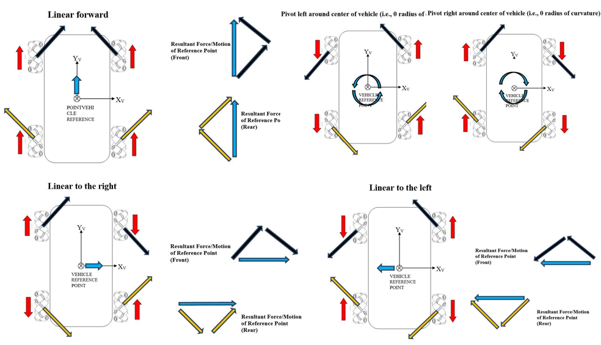
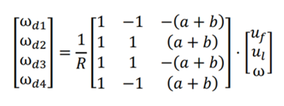
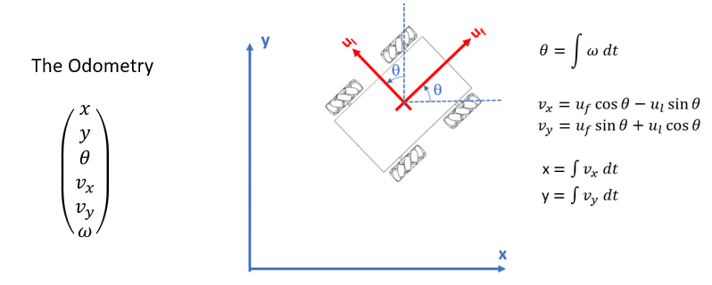
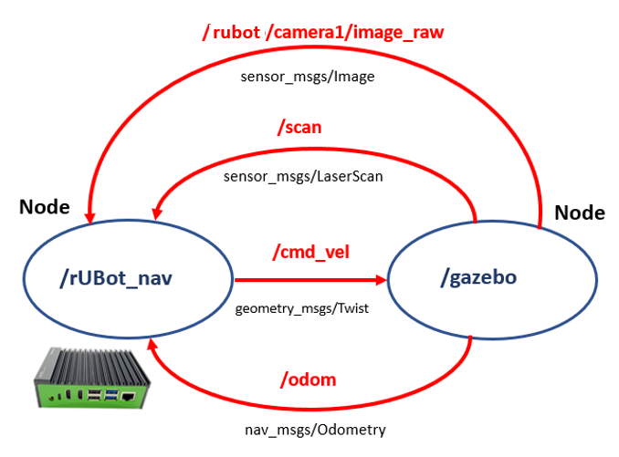
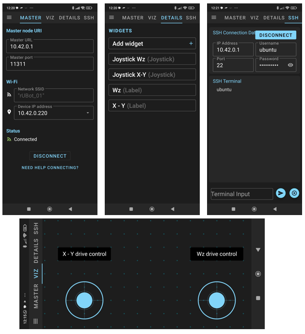

# **rUBot mecanum navigation control**

The objectives of this chapter are:
- Navigation control in virtual environment 
- Navigation control with real rUBot

We have created different activities in this section:
- Robot Navigation performances
    - Keyboard control
    - Python programming control
- Autonomous navigation with obstacle avoidance
- Robot Wall follower
- Robot go to pose

The final model represents the real rUBot we will use in the laboratory

The rUBot mecanum robot we will work is represented in the picture:


**Bibliography:**
- https://bitbucket.org/theconstructcore/workspace/projects/PS


## **1. rUBot mecanum navigation performances**

For navigation control of our robot, I have created a ROS Package "rubot_control". If you want to create it from scratch you would have to type:
```shell
cd ~/rubot_mecanum_ws/src
catkin_create_pkg rubot_control rospy std_msgs sensor_msgs geometry_msgs nav_msgs
cd ..
catkin_make
```

### **1.1. Kinematics model of mecanum robot**
The rUBot mecanum is based on a 4-wheels and has a Mecanum-drive kinematics model. We have first to analyse its kinematics model to properly control it.

Wheeled mobile robots may be classified in two major categories, holonomic (omnidirectional) and nonholonomic. 
- **Nonholonomic mobile robots**, such as conventional cars, employ conventional wheels, which prevents cars from moving directly sideways.
- **Holonomic mobile robots**, such as mecanum cars, employ omni or mecanum wheels, which allow lateral and diagonal movements

The rUBot mecanum corresponds to a Kinematic model for Holonomic Mecanum wheeled robot:

Omnidirectional wheeled mobile robots typically employ either omni wheels or mecanum wheels, which are typical wheels augmented with rollers on their outer circumference. These rollers spin freely and they allow sideways sliding while the wheel drives forward or backward without slip in that direction.

The **different movements** our car can perform are:


The **forces** involved define the robot linear and angular movement:


The **Forward Kinematics** equations are defined below:


where

- Vi: Linear speed of the wheels.
- ωdi: Angular speed of the wheels.
- Vir: Tangential speed of the rollers.
- ul: Linear velocity of the system on the X axis.
- uf: Linear velocity of the system on the Y axis.
- ω: Speed of rotation of the system on the Z axis.
- a: Distance from the center of the robot to the axis of rotation of the wheel.
- b: Distance from the center of the robot to the center of the width of the wheel.

>(see [Lynch & Park, 2017] for a complete derivation of this model).

In the **Inverse Kinematics** we want to apply a robot movement defined by:
- a linear and angular velocity using a Twist message type published in a /cmd_vel topic. 
- we need to calculate the 4 wheel speeds needed to obtain this robot velocity

This is defined by the following expressions:


To obtain the **Odometry** we use the information of (uf,ul,w) and Gazebo plugin calculates the POSE of our robot.

The analytical expressions are explained graphically in the picture:


In the case of real mecanum robot this is calculated by the robot driver as an arduino program in arduino-mega platform.

### **1.2. Navigation control in VIRTUAL environment**
We can control the movement of our robot using:
- the keyboard or a joypad
- programatically in python creating a "/rubot_nav" node

We are now ready to launch control actions.

We first bringup our robot:
``` shell
roslaunch rubot_mecanum_description rubot_bringup_sw_custom.launch
```


#### **a) Keyboard control**
You can control the rUBot with the keyboard installing the following packages:
```shell
sudo apt-get install ros-noetic-teleop-tools
sudo apt-get install ros-noetic-teleop-twist-keyboard
```

Then you will be able to control the robot with the Keyboard typing:
```shell
rosrun key_teleop key_teleop.py /key_vel:=/cmd_vel
or
rosrun teleop_twist_keyboard teleop_twist_keyboard.py
```


#### **b) Python programming control**

A first simple navigation program is created to move the robot according to a speciffic Twist message.

We will create now a first navigation python files in "src" folder:
- rubot_nav.py: to define a rubot movement with linear and angular speed during a time td

Specific launch file have been created to launch the node and python file created above:
```shell
roslaunch rubot_control rubot_nav.launch
```
Verify first that the code is working in the simulated environment.

**Activity 4: rUBot navigation in a predefined Trajectory**

If the robot moves in the correct direction, you can follow with the next objective: Create a new node for **path trajectory** definition:

- Write a new rubot_path_nav.py python file that:
    - creates a rubot_nav node
    - includes parameters: v, w, and trajectory time
    - verify the functions: square_path() and triangular_path()
    - define your proper function (star(), rombe(), etc.)
- Write the corresponding rubot_path_nav.launch file
- Verify and demonstrate the execution:
``` shell
roslaunch rubot_control rubot_path_nav.launch
```

### **1.3. Navigation control in REAL environment**

In real environment, the bringup process depends on the real robot.

To bringup the rUBot_mecanum, execute in a first terminal:
``` shell
roslaunch rubot_mecanum_description rubot_bringup_hw_rock_custom.launch
```


#### **a) Keyboard control**
You can control the rUBot with the keyboard installing the following packages:
```shell
sudo apt-get install ros-noetic-teleop-tools
sudo apt-get install ros-noetic-teleop-twist-keyboard
```

Then you will be able to control the robot with the Keyboard typing:
```shell
rosrun key_teleop key_teleop.py /key_vel:=/cmd_vel
or
rosrun teleop_twist_keyboard teleop_twist_keyboard.py
```

#### **b) Joy control**
You can control the rUBot with the Joypad following the instructions in: 
https://dev.to/admantium/radu-control-the-robot-using-a-joystick-976

- In order to work with any gamepad, we need to install additional ROS packages:
```shell
sudo apt-get install ros-noetic-teleop-twist-joy ros-noetic-joy
```
- These packages provide several ways to interact with a connected joypad. To get started, we will run a ROS node called joy_node with the parameter of the detected device file.
```shell
rosrun joy joy_node dev:=/dev/input/js0
```
- to translate the messages from the /joy topic to TWIST messages, another ROS package already performs this translation. We just need to start the teleop_twist_joynode:
```shell
rosrun teleop_twist_joy teleop_node 
```
- connect the gamepad and select the Mode2 (green and red leds)
- Subscribe to the topic /cmd_vel. Then, on your gamepad, identify the deadman switch button (in our gamepad is the triangle button) and you should see messages published on /cmd_vel topic.
- You can see that this enable a non-holonomic movement
- To enable the **holonomic movement**, you have to configure the proper parameters. 
- An exemple is created to start the 2 nodes with the proper configuration parameters. This is the **rubot_joy.launch** file.

```shell
roslaunch rubot_control rubot_joy.launch
```
> For button mapping documentation refer to: http://wiki.ros.org/joy or http://wiki.ros.org/ps3joy
> for detailed configuration of launch file refer to: https://github.com/ros-teleop/teleop_twist_joy/blob/indigo-devel/launch/teleop.launch

Cool! If you have made the bringup of your robot, you will automatically feed these messages to your robot, and you can start moving around, controlled with a gamepad.

#### **c) Smart-Phone control**
ROS-Mobile is an Android application designed for dynamic control and visualization of mobile robotic system operated by the Robot Operating System (ROS). The application uses ROS nodes initializing publisher and subscriber with standard ROS messages. (https://github.com/ROS-Mobile/ROS-Mobile-Android)

- Download from Google Playstore:
Simply go to the Google Playstore Website of the ROS-Mobile app and download it. It will be installed automatically. This video shows the installation and operation process: https://www.youtube.com/watch?v=T0HrEcO-0x0
- Connect via ssh to the Master located in the RaspberryPi4 onboard computer
- Create a proper Dashboard with the joypad desried configuration



> Every change you make you have to disconnect and connect again to proper operation

#### **d) Python programming control**
In the previous session we have created a python node to publish a Twist message in /cmd_vel topic. Verify the previous rubot_nav.launch file created for this purpose:
``` shell
roslaunch rubot_control rubot_nav.launch
```
**Lab Activity 3: rUBot navigation in a predefined Trajectory**

If the robot moves in the correct direction, you can follow with the next objective: Create a new node for **path trajectory** definition:

- Write a new rubot_path_nav.py python file that:
    - creates a rubot_nav node
    - includes parameters: v, w, and trajectory time
    - verify the functions: square_path() and triangular_path()
    - define your proper function (star(), rombe(), etc.
- Write the corresponding rubot_path_nav.launch file
- Verify and demonstrate the execution:
``` shell
roslaunch rubot_control rubot_path_nav.launch
```
Verify different trajectories inside your world
Upload the:

- rubot_path_nav.launch and rubot_path_nav.py files
- Video of the execution in REAL environment

## **2. Autonomous navigation with obstacle avoidance**
We will use now the created world to test the autonomous navigation with obstacle avoidance performance. 

The algorithm description functionality, created in "rubot_self_nav.py" file,is:
- The created node makes the robot go forward.
    - LIDAR is allways searching the closest distance and the angle
    - when this distance is lower than a threshold, the robot goes backward with angular speed in the oposite direction of the minimum distance angle.

Let's verify first this behaviour in virtual environment

### **2.1. Self-navigation control in VIRTUAL environment**

We have to launch the "rubot_self_nav.launch" file in the "rubot_control" package.
```shell
roslaunch rubot_mecanum_description rubot_bringup_sw_custom.launch
roslaunch rubot_control rubot_self_nav.launch
```


>- Verify in rviz if you have to change the fixed frame to "odom" frame
>- You can test the behaviour when tunning the parameters defined

**Activity 5: rUBot self-navigation**

The objective of this activity is to modify the code to move the robot in Holonomic way, for exemple:
-  When the minimum distance is in the right side move the robot over the left side

Design the code using the Holonomic robot performances, and upload:
- the file "rubot_self_nav_holonomic.py"
- a video of the current behaviour in your desoigned world

### **2.2. Self-navigation control in REAL environment**

To bringup the rUBot mecanum robot, execute:
```shell
roslaunch rubot_mecanum_description rubot_bringup_hw_rock_custom.launch
```
Then verify the obstacle avoidance behaviour for different parameter values.
```shell
roslaunch rubot_control rubot_self_nav.launch
```
The robot is not working as expected because the number of laser beams is nor 720 as in simulation!

**Lab Activity 4: rUBot self-navigation**

The objective of this lab session is:
- take into account the number of laser beams of your Lidar in the python code
- verify the designed holonomic self-navigation node you have created for virtual environment in the previous activity.

Upload the:
- rubot_self_nav_holonomic.launch and rubot_self_nav_holonomic.py files
- Video of the execution in REAL environment

## **3. Wall Follower**
Follow the wall accuratelly is an interesting challenge to make a map with precision to apply SLAM techniques for navigation purposes.

There are 2 main tasks:
- Create a python file "rubot_wall_follower.py" to perform the wall follower in the maze of our mecanum robot
- Create a launch file "rubot_wall_follower.launch" to initialyse all the needed nodes in our system for this control task

### **3.1. Wall follower in VIRTUAL environment**

We have created a rubot_wall_follower_rg.py file based on the reading distances from LIDAR in the ranges: front, front-right, right and back-right, and perform a specific actuation in function of the minimum distance readings.

Follow the instructions to create the rubot_wall_follower_rg.py python file: https://www.theconstructsim.com/wall-follower-algorithm/

The algorith is based on laser ranges test and depends on the LIDAR type:


Open a terminal and type:
```shell
roslaunch rubot_mecanum_description rubot_bringup_sw_custom.launch
roslaunch rubot_control rubot_wall_follower_rg.launch
```
The wall-follower algorithm is not finished and surelly your robot is not able to follow the wall!

**Activity 6: rUBot wall-follower**

The objective of this activity is:
- Understand the wall-follower algorithm
- complete the code to follow the walls of your designed world
- verify the performances with a concave corners
- create a new algorithm using the holonomic performances of rUBot mecanum

Upload:
- the rubot_wall_follower.py code completed
- video of simulated behaviour in concave corners
- the proposed code "rubot_wall_follower_holonomic.py"
- video of simulated behaviour with holonomic performances

### **3.2. Wall follower in REAL environment**

To bringup the Mecanum robot, execute in a first terminal:
```shell
roslaunch rubot_mecanum_description rubot_bringup_hw_rock_custom.launch
```
Then verify the obstacle avoidance behaviour for different created programs.

```shell
roslaunch rubot_control rubot_wall_follower_rg_custom.launch
```
**Lab Activity 5: rUBot wall-follower HW**

The objective of this activity is:
- verify the performances of the designed code in the previous activity with your real rUBot
- Improve your new algorithm using the holonomic performances of rUBot mecanum

Upload:
- video of simulated behaviour in concave corners
- the proposed code "rubot_wall_follower_holonomic.py"

## **4. Go to POSE**
Define a specific Position and Orientation as a target point to go:
- x target point
- y target point
- f yaw orientation angle in deg

### **4.1. Go to POSE in VIRTUAL environment**

A node is created in "rubot_go2pose.py" file to reach the POSE destination with a tolerance. We have modified the python script developed in turlesim control package according to the odom message type

For validation type:
```shell
roslaunch rubot_mecanum_description rubot_bringup_sw_custom.launch
roslaunch rubot_control rubot_go2pose.launch
```


Test different POSE targets before to test it with REAL robot.

### **4.2. Go to POSE in REAL environment**

In a real environment, there is very important the POSE precision. The Odometry computing is made with wheels readings. The floor characteristics and slings can produce inacuracies in odometry calculations.

It is important the include other sensors to obtain a better accuracy. In our case we have included an IMU sensor to obtain a better measurement of the orientation.

We will test the obtained POSE accuracy with:
- Computing the Odometry with the wheel readigns
- Computing the Odometry with the wheel readigns but measuring the robot orientation using the IMU sensor.

We will have to:
- upload a new arduino program to read and calibrate the IMU sensor to measure the robot orientation
- Calibrate the IMU sensor only a first time with speciffic arduino program
- Bringup the Mecanum robot, using a new arduino program to measure the robot orientation with the IMU sensor:
```shell
roslaunch rubot_mecanum_description rubot_bringup_hw_rock_custom.launch
```
- Then verify the same node with the real Mecanum robot:
```shell
roslaunch rubot_mecanum_description rubot_go2pose.launch
```


