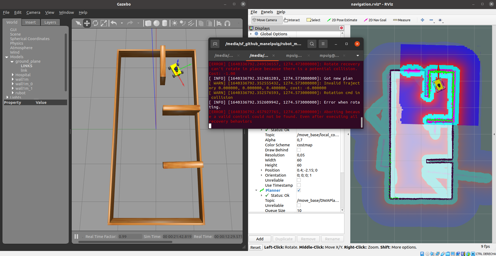

# **SLAM & Navigation rUBot mecanum**
Autonomous navigation refers that the robot is able to move autonomously around the environment avoiding any obstacle.

In a logistics warehouse, a delivery robot carries samples or food from one room to another. 

The main objectives are:
- use SLAM (Simultaneous Localization and Mapping) techniques to generate and store a map of the logistics warehouse flor
- use Navigation techniques to find an optimal trajectory to reach a speciffic logistics warehouse target position

SLAM is a technique used in robotics to explore and map an unknown environment while estimating the pose of the robot itself. As it moves all around, it will be acquiring structured information of the surroundings by processing the raw data coming from its sensors.

let's see how to fulfill these objectives


## **Install ROS navigation & SLAM packages**

First, let's prepare your machine with the required ROS packages needed for the navigation stack (http://wiki.ros.org/navigation):
```shell
sudo apt install ros-noetic-navigation
```
And finally the slam_gmapping package, that is already available in its binary version (https://wiki.ros.org/slam_gmapping)
```shell
sudo apt install ros-noetic-slam-gmapping
```
Also for some transformations you will need to install transforms3d:
```shell
sudo apt install python3-pip
sudo pip3 install transforms3d
```
Open the .bashrc file and verify to source to the proper workspace:
```shell
source /home/user/rUBot_mecanum_ws_/devel/setup.bash
```
change the path corresponding to your ws

To perform SLAM & Navigation, we need to create a specific **"rubot_slam" package**.

This package is already created in the simulation ws. Take the same "rubot_slam" package and make few modifications to use it to:
- generate the map of your maze
- navigate to speciffic target points within the map

This repository is essentially the one corresponding to turtlebot3 adapted for the mecanum robot prototype:

https://github.com/ROBOTIS-GIT/turtlebot3

Now you can follow the next steps:

## **1. Generate the map**

To generate the map we need first to:
- Bringup rUBot_mecanum
```shell
roslaunch rubot_slam rubot_slam_bringup_sw.launch
```
- Start the slam_gmapping node
```shell
roslaunch rubot_slam rubot_slam.launch
```
This node is highly configurable and has lots of parameters you can change in order to improve the mapping performance. (http://wiki.ros.org/gmapping)

Let's now check some of the most important ones that usually have to be changed:

- base_frame (default: "base_link"): Indicates the name of the frame attached to the mobile base.
- map_update_interval (default: 5.0): Sets the time (in seconds) to wait until update the map. (I take 1s)
- delta (default: 0.05): Sets the resolution of the map (I take 0.01m)

Open the "gmapping.launch" file and change properly the parameters you consider. 

- use the navigation program you have designed to follow the walls for exemple to properly generate the map.
```shell
roslaunch rubot_control rubot_wall_follower_rg.launch
```
- or let's do this as usual with the teleoperation package:
```shell
rosrun teleop_twist_keyboard teleop_twist_keyboard.py
```


- Once you have finish the map, you need to launch the map_saver program from map_server package:
```shell
cd src/rubot_slam/maps
rosrun map_server map_saver -f test_map
```
The map files will be saved in local directory

You will get two files in the specified folder of your workspace: 
- test_map.pgm (2D B&W map picture)
- test_map.yaml (map parameters)

Provided with the map, we are ready to perform robot navigation with the rUBot_mecanum robot.

You can close now the "rubot_slam.launch" file.

## **2. Navigate to speciffic target points within the map**

When the robot moves around a map, it needs to know which is its POSE within the map.

The AMCL (Adaptive Monte Carlo Localization) package provides the amcl node, which uses the MCL system in order to track the localization of a robot moving in a 2D space. This node subscribes to the data of the laser, the laser-based map, and the transformations of the robot, and publishes its estimated position in the map.

On startup, the amcl node initializes its particle filter according to the parameters provided.

This AMCL node is also highly customizable and we can configure many parameters in order to improve its performance. (http://wiki.ros.org/amcl)

Let's have a look at some of the most important ones:

**General Parameters**

These parameters will allow you to configure how the localization is performed and are located in "amcl.launch" file:

- odom_model_type (default: "diff"): It puts the odometry model to use. It can be "diff," "omni," "diff-corrected," or "omni-corrected."
- base_frame_id (default: "base_link"): Indicates the frame associated with the robot base.

**Costmap Parameters**

These parameters will allow you to configure the way that the navigation is performed and are located in "costmap_common_params.yaml" file:

- footprint: dimensions of the base_footprint for colision information
- Inflation radius: increase dimensions of obstacles to prevent colisions
- cost scaling factor: to define allowed regions among obstacles to define the optimal trajectory.

Review these parameters in "costmap_common_params.yaml"

**move_base Parameters**

Consider to modify:
- controller_frequency to 5.0Hz instead of 10.0Hz

You can refine some parameters considering the recommendations in: https://emanual.robotis.com/docs/en/platform/turtlebot3/navigation/#tuning-guide

>Careful!!
>
>global & local_costmap_params.yaml: specify the robot_base_frame as "base_footprint" link according to the URDF file. This link is the first one and has TF connection to the world

To navigate within the map we need first to:
- Bringup rUBot_mecanum (if you have closed it before)
```shell
roslaunch rubot_slam rubot_slam_bringup_sw.launch
```
- Launch the rubot_navigation file
```shell
roslaunch rubot_slam rubot_navigation.launch
```
>Take care in launch file to read the correct robot model name and the correct map file in "maps" folder
- Set up an initial pose by using the 2D Pose Estimate tool (which published that pose to the /initialpose topic).
- To obtain a proper localisation of your robot, move it right and left using the key_teleop.
```shell
rosrun teleop_twist_keyboard teleop_twist_keyboard.py
```


- Select the target goal to navigate with the tool "2D-Nav-Goal"
- With a "Differential Drive" kinematics robot structure, the mobility is not optimum and some target poits are not accessible and the program is aborted



- Using "omni" drive performances, the robot is able to move also in y direction and the mobility is much better.

- You need to modify the "dwa_local_planner_params_burger.yaml parameters. 


You can see the optimized trajectory. The robot starts to follow this trajectory and if an obstacle appears, the robot avoid this obstacle and find in realtime the new optimal trajectory to the target point. 


## **3. Programatic control of Robot Navigation**

When we want to perform a complex task, the robot navigation has to be made programatically. We will be able to perform:
- Init Pose selection
- Send a goal to navigation stack
- Send a sequence of goals to navigation stack

### **3.1. Init Pose selection**

The init pose is a mesage that has to be published th a /initpose topic.

The message type is "PoseWithCovarianceStamped"

A simple program has been designed for this purpose in "init_pose.py". You have to select the correct pose in python file

```shell
roslaunch rubot_slam rubot_slam_bringup_sw.launch
roslaunch rubot_slam rubot_navigation.launch
rosrun rubot_slam init_pose.py
```

### **3.2. Send a goal to navigation stack**

The move_base ROS Node, allows to configure, run and interact with the robot navigation. The move_base node implements a SimpleActionServer with a single navigation goal.

References: 
- https://github.com/markwsilliman/turtlebot
- https://learn.turtlebot.com/2015/02/04/5/


The goal pose is of geometry_msgs/PoseStamped message type. 

To communicate with this node, the SimpleActionClient interface is used. The move_base node tries to achieve a desired pose by combining a global and a local motion planners to accomplish a navigation task which includes obstacle avoidance.


We can create a node to:
- Define a Init Pose
- Define a first navigation goal

The code is created in "first_goal.py" code

```shell
roslaunch rubot_slam rubot_slam_bringup_sw.launch
roslaunch rubot_slam rubot_navigation.launch
rosrun rubot_slam first_goal.py
```

### **3.3. Send a sequence of goals to navigation stack**

When different goals have to be defined, We will use a yaml file to define the waypoints and a launch file define the needed parameters.

We have to specify the waypoints as pose in (x,y,w) values and create a new create_pose_stamped(position_x, position_y, rotation_z) function

```shell
roslaunch rubot_slam rubot_slam_bringup_sw.launch
roslaunch rubot_slam rubot_navigation.launch
rosrun rubot_slam waypoints_goal.py
```
If you want to work with ROS parameters, you can define the waypoints in a "waypoints.yaml" file on config folder:
```python
goal1: {"x": -0.5, "y": 0.8, "w": 90}
goal2: {"x": -0.5, "y": -0.5, "w": 180}
```
and load the yaml file in a "waypoints_goal.launch" file:
```xml
<launch>
  <node pkg="gopigo3_slam" type="waypoints_goal_params.py" name="movebase_client_waypoints" output="screen" >
    <rosparam file="$(find gopigo3_slam)/config/waypoints.yaml" command="load" />
  </node>
</launch>
```

```shell
roslaunch rubot_slam rubot_slam_bringup_sw.launch
roslaunch rubot_slam rubot_navigation.launch
roslaunch rubot_slam waypoints_goal.launch
```
