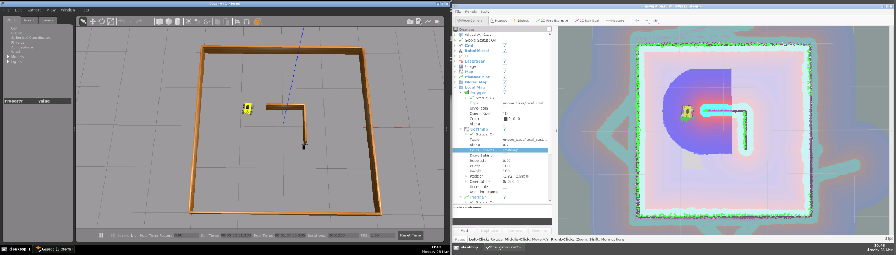
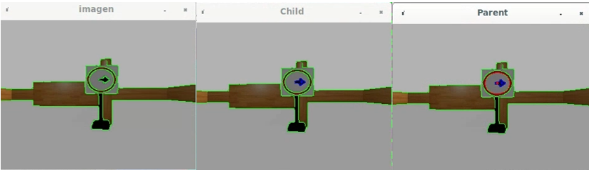
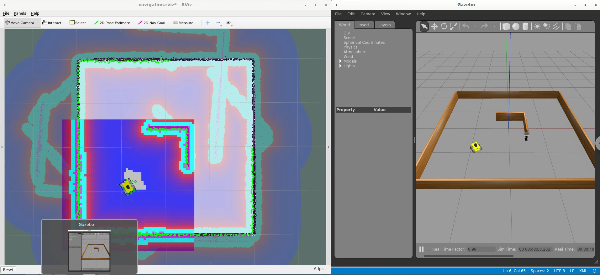
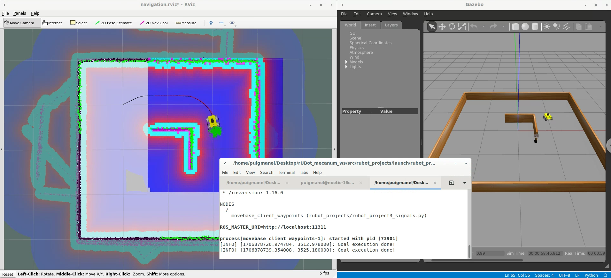

# **rUBot mecanum challenging projects**

The projects proposed will be based on:

- Video and picture caption
- rUBot navigation with Image processing

The different projects will be:

- 1. rUBot takes photo
- 2. Go to specific point in the map and take a photo
- 3. Follow a point based trajectory with traffic signs

References OpenCV:

- http://wiki.ros.org/cv_bridge/Tutorials/ConvertingBetweenROSImagesAndOpenCVImagesPython
- https://docs.opencv.org/4.x/d6/d00/tutorial_py_root.html
- https://github.com/Akshay594/OpenCV/tree/master/tutorials

References for webcam:

- https://automaticaddison.com/working-with-ros-and-opencv-in-ros-noetic/

References:

- https://learn.turtlebot.com/
- https://learn.turtlebot.com/2015/02/04/1/
- https://learn.turtlebot.com/2015/02/04/2/
- https://learn.turtlebot.com/2015/02/04/3/
- https://github.com/markwsilliman/turtlebot
- http://wiki.ros.org/Camera%2BDynamixelRobotSample/CameraPictureServer
- https://industrial-training-master.readthedocs.io/en/melodic/_source/session5/OpenCV-in-Python.html

The first step is to create a new package "rubot_projects" with dependencies:

- rospy
- sensor_msgs
- std_msgs
- cv_bridge

```shell
catkin_create_pkg rubot_projects rospy std_msgs sensor_msgs cv_bridge
```

This package is already created and ready to use it!. You have not to create it.

We will perform some specific projects related to rUBot vision capabilities in a navigation process.

## **Project 1: rUBot takes photo**

The objective is to program a python code to take a photo using usb-cam in robot prototype.

Important information is taken from: https://learn.turtlebot.com/2015/02/04/3/

Follow the procedure:

- Bringup the rUBot and identify the topic name where raspicam publishes the photo as a mesage of type sensor_msgs:

**For virtual environment use:**

```shell
roslaunch rubot_projects rubot_projects_bringup_sw.launch 
rostopic list
```
**For real rUBot use:**

```shell
roslaunch rubot_projects rubot_projects_bringup_hw_rock.launch 
rostopic list
```
- Then modify the "take_photo.py" python file with:
  - the proper topic name:
    - for simulation: /rubot/camera1/image_raw
    - for real rUBot: /usb_cam/image_raw
  - the proper photo filename in folder path: ./src/rubot_projects/photos/photo_sim.jpg
- run the "take_photo.py" python file to take a photo

```shell
rosrun rubot_projects rubot_project1_picture.py
```
If you use a launch file, you have to specify the absolute path: 
- "/home/puigmanel/Desktop/rUBot_mecanum_ws/src/photos/photo3_sw.jpg"
- or use "$(find rubot_projects)/photos/photo3_sw.jpg"
```shell
roslaunch rubot_projects rubot_project1_picture.launch
```
- Open the "photos" folder and you will see the photo1_sw.jpg created


## **Project 2: Navigate to a sequence of goals in the map and take a photo**

The objective is to navigate to 2 different targets and take pictures.

We will combine the two programs:

- Send a sequence of goals to navigation stack
- Take a Photo 

We will take a "goals_foto.yaml" file to specify the POSE goal and Photo path-name.

Proceed with the following steps:

- Launch bringup in Gazebo virtual environment: square2.world

  ```shell
  roslaunch rubot_projects rubot_projects_bringup_sw.launch
  ```
- Run the navigation (verify the map file!):

  ```shell
  roslaunch rubot_slam rubot_navigation.launch
  ```
- Launch the "rubot_project2_navigation_picture.launch" program:

  ```shell
  roslaunch rubot_projects rubot_project2_navigation_picture.launch
  ```

> Careful!:
> Use "rospack" to obtain the absolute path to the photo. Alternative is to specify the absolute path that will be different for each student




## **Project 3: Follow a point based trajectory with traffic signs**

Important information can be obtained here:

- https://www.theconstructsim.com/morpheus-chair-create-a-linefollower-with-rgb-camera-and-ros-episode-5/
- https://www.youtube.com/watch?v=9C7Q8bRERgM
- https://github.com/noshluk2/ROS2-Self-Driving-Car-AI-using-OpenCV

Related to the links:

- http://www.rosject.io/l/8292943/
- https://en.wikipedia.org/wiki/Differential_wheeled_robot

And with the code:

- https://bitbucket.org/theconstructcore/morpheus_chair/src/master/

The nexts steps will be:

- world setup
- bringup the robot
- create the map
- create the "point based trajectory"
- Signal identification
- SLAM and Navigation within the tajectory

### **1. World setup**

We have created different models to include in gazebo world:

- Walls
- square
- Trafic signs
- road

We will construct first these models in a specific folder:

- rubot_mecanum_ws/src/rubot_mecanum_description/models

We have to add this folder to GAZEBO_MODEL_PATH tenvironment variable. This is done either:

- in ~/.bashrc file adding this line (needed for simulation to find the models):

```xml
export GAZEBO_MODEL_PATH=$HOME/rUBot_mecanum_ws/src/rubot_mecanum_description/models:$GAZEBO_MODEL_PATH
```

> If you want to delete any model path from gazebo, load the "gui.ini" file from .gazebo folder. There is a list of model paths and you can delete the one you do not want

- or copy the models folder in ~/.gazebo/models/

#### **Create a world file**
The best way to create a world, you can:
- add models in our empty world 
- add each model in the last part of your world file (here starts with empy.world):

```xml
<sdf version="1.5">
  <world name="default">
    <!-- A global light source -->
    <include>
      <uri>model://sun</uri>
    </include>
    <!-- A ground plane -->
    <include>
      <uri>model://ground_plane</uri>
    </include>
    <!-- A Square 4m -->
    <include>
      <uri>model://square4m</uri>
      <pose>0 0 0 0 0 0</pose>
    </include>
    <!-- A wall90cm -->
    <include>
      <uri>model://wall90cm</uri>
      <name>wall90_1</name>      
      <pose>0.5 0 0 0 0 1.57</pose>
    </include>
    <!-- A wall90cm -->
    <include>
      <uri>model://wall90cm</uri>
      <name>wall90_2</name>
      <pose>0.05 0.45 0 0 0 0</pose>
    </include>
    <!-- A traffic sign -->
    <include>
      <uri>model://sign_right</uri>
      <pose>0.5 -0.5 0.01 0 0 0</pose>
    </include>
  </world>
</sdf>
```

### **2. Bringup the robot**

We spawn our robot into gazebo world: "square4m_sign_right.world"

```shell
roslaunch rubot_projects rubot_projects_bringup_sw.launch
```


### **3. Create the map**

To create the MAP, we start the slam_gmapping node
```shell
roslaunch rubot_slam rubot_slam.launch
```
- use the navigation program you have designed to follow the walls for exemple to properly generate the map.
```shell
roslaunch rubot_control rubot_wall_follower_rg.launch
```
- or let's do this as usual with the teleoperation package:
```shell
rosrun teleop_twist_keyboard teleop_twist_keyboard.py
```


```shell
cd src/rubot_slam/maps
rosrun map_server map_saver -f project3_map
```

### **4. Create the "point based trajectory"**

You have to define the waypoints in a "trajectorys.yaml" file on rubot_projects/config folder:
```python
goal_s:
  x: 0.5
  y: -1
  w: 90
  photo_name: 'goal_s.png'

goal_r:
  x: 1
  y: 0.5
  w: 90
  photo_name: 'goal_r.png'

goal_l:
  x: 0
  y: 0
  w: 90
  photo_name: 'goal_l.png'

goal_t:
  x: -1
  y: 1
  w: 180
  photo_name: 'goal_t.png'

img_topic: '/rubot/camera1/image_raw'
```

### **5. Signal identification**

To identify the signal placed in each waypont, you can use:
- Image processing techniques
- Image identification techniques

With the code created, you will be able to identify the signal you have found. The next waypoint will depend on the signal identified.

If you use Image processing techniques to identify the contours:
- you can select the external circle contorur (parent) and the internal arrow contour (child) of signal
- obtain the gravity center (momentum)
- obtain the difference of gravity centers to identify right (positive) or left (negative) Traffic Signal



**Lab Activity 8: rUBot signal identification**

The objective of this activity is:
- Identify the "right" and "left" traffic signals using:
  - Image processing techniques
  - Image Identification techniques

To bringup the real robot for the Project process use the speciffic launch file:
```shell
roslaunch rubot_projects rubot_projects_bringup_hw_rock.launch
```

Upload:
- video of real process for signal identiffication
- the description of the techniques you have used
- the final "TrafficSignalsDetection.py" code

### **6. SLAM and Navigation within the tajectory**

You have to create the trajectory.py file to:
- go to the first waypoint
- take picture of the signal
- identify the signal
- choose and go to the next waypoint
- go to the final target point

First of all you have to bringup your rUBot:

when simulating in virtual environment:
```shell
roslaunch rubot_projects rubot_projects_bringup_sw.launch
```

when using the real robot:
```shell
roslaunch rubot_projects rubot_projects_bringup_hw_rock.launch
```
You will have then to execute the Navigation on the project Map: "project3_map.yaml"
```shell
roslaunch rubot_slam rubot_navigation.launch
roslaunch rubot_projects rubot_project3_signals.launch
```






You can see a video of the final process:
[Drive with Right Traffic Signal](https://www.youtube.com/watch?v=lLoMEeCuRck "Título alternativo")

Video link: https://youtu.be/lLoMEeCuRck


**Lab Activity 9: rUBot drive with traffic signals**

The objective of this activity is:
- To drive the rUBot in a predesigned world considering:
  - a list of target points defined in "goals_project3.yaml" file
  - a traffic signal located in the first target point which defines the following target point

To accomplish the objective you will have to:
- Modify the "rubot_project2_navigation_picture.py" file to accomplish the project objectives
- import the "TrafficSignalsDetection.py" in previous python file for the identification process


To bringup the real robot for the Project process use the speciffic launch file:
```shell
roslaunch rubot_projects rubot_projects_bringup_hw_rock.launch
```

Upload:
- video of real process project
- the final "rubot_project3_signals.py" code