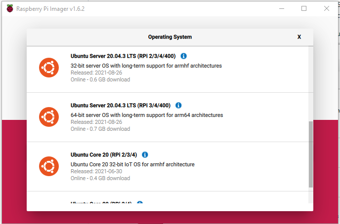
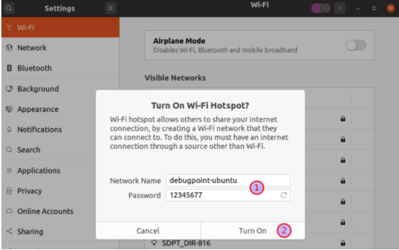
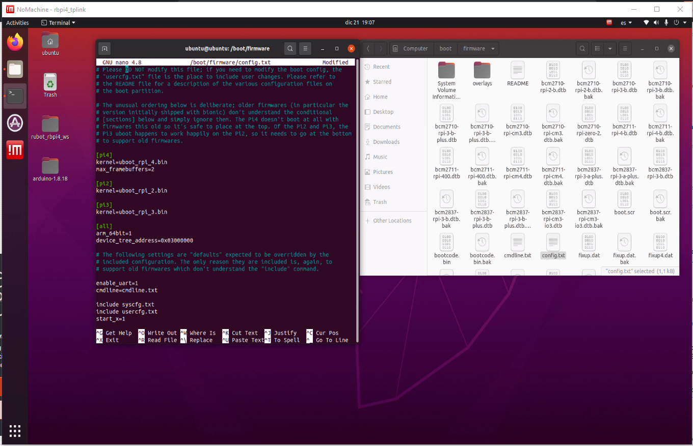

# **rUBot mecanum in Raspberrypi4 Setup&Control**

The main objectives are:
- Assemble a real robot (rUBot mecanum)
- Setup the HW drivers in raspberrypi4
- Control the rUBot movement


Let's see how to fulfill these objectives

References:
- https://github.com/ros-mobile-robots/diffbot
- https://johanschwind.medium.com/mobile-robot-teleoperation-with-the-jetson-nano-and-ros-d72b4b57e9be

## **1. rUBot assembling**

This tobot prototype is based on:
- Mecanum wheel chasis:
  - https://es.aliexpress.com/item/4001121790912.html?gatewayAdapt=glo2esp&spm=a2g0o.9042311.0.0.3c7963c0XKupJW
- Battery 12V&5V (3Ah):
  - https://www.amazon.es/gp/product/B072HR211P/ref=ppx_yo_dt_b_asin_title_o05_s00?ie=UTF8&psc=1
- Battery 12V (6,7 and 20Ah): 
  - https://www.amazon.es/gp/product/6040388099/ref=ewc_pr_img_1?smid=A17M1OH9UAKGE7&psc=1
  - https://www.amazon.es/gp/product/B07YSCXGNF/ref=ppx_yo_dt_b_asin_title_o07_s00?ie=UTF8&psc=1
  - https://www.amazon.es/THENAGD-Recargable-Interruptor-Encendido-DC-122000/dp/B091F465RP/ref=sr_1_48?__mk_es_ES=%C3%85M%C3%85%C5%BD%C3%95%C3%91&crid=3OCUQZILUVPAJ&keywords=bateria%2B5v%2B12v%2B2a%2Brecargable&qid=1642669235&sprefix=bateria%2B5v%2B12v%2B2a%2Brecargable%2Caps%2C65&sr=8-48&th=1
- Battery 12V/5V
  - https://www.amazon.es/gp/product/B072HR211P/ref=ppx_yo_dt_b_asin_title_o05_s00?ie=UTF8&psc=1
  - https://www.amazon.es/gp/product/6040387874/ref=ox_sc_act_title_1?smid=A17M1OH9UAKGE7&psc=1 
- Battery 5V (20 and 26Ah):
  - https://www.amazon.es/dp/B09MYQFXP5?psc=1&smid=AKVUAZL0K2E1J&ref_=chk_typ_imgToDp
  - https://www.amazon.es/SWEYE-Capacidad%EF%BC%BDCargador-M%C3%BAltiples-Protecciones-Smartphones/dp/B0814JMRLR/ref=sr_1_18?__mk_es_ES=%C3%85M%C3%85%C5%BD%C3%95%C3%91&crid=3OCUQZILUVPAJ&keywords=bateria+5v+12v+2a+recargable&qid=1642669235&sprefix=bateria+5v+12v+2a+recargable%2Caps%2C65&sr=8-18
- On-board Raspberrypi4
  - https://es.rs-online.com/web/p/raspberry-pi/2012367
  - https://es.rs-online.com/web/p/placas-hat-y-complementos-para-raspberry-pi/2208633
- Arduino mega: for HW driver control
  - https://es.rs-online.com/web/p/arduino/7154084
- Arduino motor driver shield TB6612FNG:
  - https://es.aliexpress.com/item/4001086592215.html?spm=a2g0o.productlist.0.0.55da155eRs0f1N&algo_pvid=523f34f9-da3e-4a7e-bcbd-927dc560fb14&algo_exp_id=523f34f9-da3e-4a7e-bcbd-927dc560fb14-40
  - https://github.com/Seeed-Studio/Grove_Motor_Driver_TB6612FNG
- RaspiCAM RGB camera:
  - https://es.rs-online.com/web/p/camaras-para-raspberry-pi/9132664
  - https://es.rs-online.com/web/p/cajas-para-raspberry-pi/8679049
- rpLidar:
  - https://www.robotshop.com/es/es/rplidar-a1m8-kit-desarrollo-escaner-laser-360-grados.html
- USB cables:
  - USB-A to USB-B: https://www.amazon.es/gp/product/B073XQ33L2/ref=ppx_yo_dt_b_asin_title_o01_s00?ie=UTF8&th=1
  - USB-C to USB-B: https://www.amazon.es/gp/product/B08RXQJJ9Z/ref=ppx_yo_dt_b_asin_title_o02_s00?ie=UTF8&th=1
  - microUSB to USB-B: https://www.amazon.es/gp/product/B00WMAQKS2/ref=ppx_yo_dt_b_asin_title_o04_s00?ie=UTF8&th=1


Other platforms:
- https://www.superdroidrobots.com/robotic-kits-platforms/mecanum-robots
- https://www.robotshop.com/es/es/kit-robot-arduino-con-rueda-mecanum-4wd-60-mm.html
- https://www.robotshop.com/es/es/4wd-robot-basico-mecanum-compatible-con-arduino.html

## **2. Setup the HW drivers in raspberrypi4**
The raspberrypi4 onboard is preinstalled with:
- Ubuntu 20 server 64bits
  - NoMachine remote desktop
- ROS Noetic
- rubot_rbpi4_ws repository is located in /home/pi/Desktop folder 

### **2.1. Install Ubuntu 20 server 64bits**

Follow the steps in order to properly install the Raspberrypi:

- Install Raspberry Pi OS using Raspberry Pi Imager (download for windows): https://www.raspberrypi.org/software/
- Run the application and save the image:
  - Ubuntu --> Ubuntu 20 server 64bits to the SD card


- Insert the SD in a RBPi board and connect it to screen and ethernet cable to the router
- power the raspberrypi4 and login:
  - login: ubuntu
  - password: ubuntu
- You will have to change the password (we use ubuntu1234)
> Note: 
> - Connect HDMI just after power rbpi4
> - Keyboard is not ESP and "-" is on "'" key

**Install Ubuntu Desktop**

In the terminal, type:
```shell
sudo apt-get install ubuntu-desktop
```
> Follow instructions:
>- Perhaps you may type "sudo dpkg --configure -a"

After some minutes, the desktop is installed. 
> You have to update and upgrade the ubuntu now (type it several times untill all packages will be updated)

Type:
```shell
reboot
```
You will get the ubuntu 20 desktop

- choose a wifi network and change the timezone, language and password

**Install nomachine remote desktop**

Download nomachine in RaspberryPi and PC:
- In raspberryPi:
  - Download the Raspberrypy4 version ARMv8 DEB in: https://www.nomachine.com/download/linux&id=29&s=Raspberry
  - open a terminal in download folder and install following the instructions
- In PC: https://www.nomachine.com/

**Notebook visualization in raspberrypi**

Use the NBviewer program from Jupyter:

https://nbviewer.ipython.org/

### **2.2. ROS Noetic Desktop installation**

Follow the instructions on: http://wiki.ros.org/noetic/Installation/Ubuntu
> Is recommended to update and upgrade first:
```shell
sudo apt update
sudo apt upgrade
sudo apt update
```
### **2.3. Create WiFi Hotspot and setup**

Follow instructions in: https://www.debugpoint.com/2020/04/how-to-create-wifi-hotspot-in-ubuntu-20-04-lts/


>Carefull!:
>- If "Turn On Wi-Fi Hotspot is disabled select another setting (i.e. Bluetooth) and come back to Wi-Fi setting
>- Choose a SSID corresponding to your robot name

To select this Hotspot automatically on restart:
- open a terminal and see all the connection names:
```shell
nmcli con show
```
- Make the connection "Hotspot" start automatically:
```shell
nmcli con mod Hotspot connection.autoconnect yes
``` 
- Verify listing all the Hotspot parameters including "autoconnect"
```shell
nmcli con show Hotspot
```
- Identify the IP of the rbpi4 Hotspot:
  - type ifconfig
  - in wlan0 you identify the inet address: 10.42.0.1

**Setup**

The raspberrypi4 is configured:
- to generate a hotspot "rUBot_xx"
- NoMachine activated 
- raspicam activated 

When powering the raspberrypi4, generates a hotspot you have to connect to:
- SSID name: rUBot_01 
- password "rUBot_Mec"

Once you are connected to this network you will be able to connect your computer to the raspberrypi4 using NoMachine viewer:
- In PC open NoMachine viewer
- Select the raspberrypi IP address: 10.42.0.1
- you have to specify:
    - user: ubuntu
    - password: ubuntu1234
- You will have the raspberrypi4 desktop on your windows NoMachine screen


If you want to change the Hotspot name (one for each robot):
- Change the Hotspot settings (name or password):
```shell
sudo nm-connection-editor
```

### **2.4. Create your workspace**

We will create the workspace where we will install all needed packages for our Hardware project
```shell
mkdir -p ~/Desktop/rubot_rbpi4_ws/src
cd ~/Desktop/rubot_rbpi4_ws/
catkin_make
echo "source ~/Desktop/rubot_rbpi4_ws/devel/setup.bash" >> ~/.bashrc
```
We will install:
- Raspberrypi camera
- rpLIDAR
- Arduino board with rosserial
### **Install raspberrypi camera**
Information is located on: https://picamera.readthedocs.io/en/release-1.11/install.html


You need to activate the raspicam in Ubuntu:
- open the file config.txt
```shell
sudo nano /boot/firmware/config.txt
```
- add the magic line start_x=1 at the end


- reboot
- update your system to install the necessary drivers:
```shell
sudo apt update
sudo apt upgrade
```
Now we will install the python module for picamera:
```shell
sudo apt install python3-pip
pip install picamera
```
And the needed libraries for raspicam package:
```shell
sudo apt-get install -y libyaml-cpp-dev
sudo apt-get install -y libogg-dev libvorbis-dev libtheora-dev
```
Finally to work with raspicam in ROS, you need to install the packages:
```shell
git clone https://github.com/UbiquityRobotics/raspicam_node.git
git clone --single-branch --branch=noetic-devel https://github.com/ros-perception/image_transport_plugins.git
git clone --single-branch --branch=noetic https://github.com/ros-perception/vision_opencv.git
git clone --single-branch --branch=noetic-devel https://github.com/ros-perception/image_common.git
```
> Follow the Build instructions in: https://github.com/UbiquityRobotics/raspicam_node.

> Make sure that your user is in the video group by running groups|grep video 
```shell
sudo usermod -a -G video ubuntu
```


Then you are able to compile the workspace:
```shell
cd ~/Desktop/rubot_rbpi4_ws/
catkin_make
```

### **Install rpLIDAR**

Open a terminal in src folder and type:
```shell
cd ~/Desktop/rubot_rbpi4_ws/src
git clone https://github.com/Slamtec/rplidar_ros
cd ..
catkin_make
```
To test the sensor, connect the LIDAR sensor to RB Pi and execute:
```shell
roslaunch rplidar_ros view_rplidar.launch
```
### **Install ARDUINO**

This robot will be controlled by an Arduino Mega board.

The arduino program will start a serial_node with all the topics

The Arduino programm is located in "files/Arduino_node" folder.

Considering your Raspberry computer uses Ubuntu 20, as explained in previous sections, you need to download Arduino IDE version for Linux ARM 64 bits from the following link: https://www.arduino.cc/en/software.

After dowloading the zip file, reclocate it and unzip it in the Tools folder: ~/Tools/Arduino-1.8.18. From this directory, open a terminal and execute the following commands:

```shell
sudo ./install.sh
cd ~
gedit .bashrc
export PATH=$PATH:$HOME/Desktop/Arduino-1.8.18
```
Save and close the file and install rosserial for ROS Noetic using:
```shell
sudo apt-get install ros-noetic-rosserial-arduino
sudo apt-get install ros-noetic-rosserial
```
Go to ~/Desktop/Arduino-1.8.18/libraries directory and remove ros_lib folder. From this directory execute:
```shell
rosrun rosserial_arduino make_libraries.py .
```

Test Arduino ROS library with "Hello World" exemple: http://wiki.ros.org/rosserial_arduino/Tutorials/Hello%20World


### **Manage USB ports**

The rbpi4 manage arduino board and rpLIDAR with 2 USB ports. 

We have to force the same USB port to the same device:
- "arduino" port to arduino mega board
- "rplidar" port to rpLIDAR

This can be done creating UDEV rules for each devide:

**a) Arduino udev rules**

Follow instructions: 
- https://steve.fi/hardware/arduino-basics/
- https://medium.com/@darshankt/setting-up-the-udev-rules-for-connecting-multiple-external-devices-through-usb-in-linux-28c110cf9251

  Connect the Arduino Mega in USB port. To see the port name type:
  ```shell
  ls -l /dev/ttyAMC*
  ```
  Give permissions rwx to this port ttyACM*
  ```shell
  sudo chmod 777 /dev/ttyACM*
  ```
  To see the needed properties to create udev rules, type:
  ```shell
  lsusb
  ```
  You will see:
  ```shell
  ubuntu@ubuntu:/usr/lib/udev/rules.d$ lsusb
  Bus 002 Device 001: ID 1d6b:0003 Linux Foundation 3.0 root hub
  Bus 001 Device 007: ID 2341:0042 Arduino SA Mega 2560 R3 (CDC ACM)
  Bus 001 Device 004: ID 0e8f:00fb GreenAsia Inc. 
  Bus 001 Device 003: ID 04d9:a01c Holtek Semiconductor, Inc. wireless multimedia keyboard with trackball [Trust ADURA 17911]
  Bus 001 Device 002: ID 2109:3431 VIA Labs, Inc. Hub
  Bus 001 Device 001: ID 1d6b:0002 Linux Foundation 2.0 root hub
  ```
  The create a file /etc/udev/rules.d/99-arduino.rules and give it the following contents:
  ```xml
  # Arduino port definition
  SUBSYSTEM=="tty", GROUP="plugdev", MODE="0660"

  ACTION=="add", SUBSYSTEMS=="usb", ATTRS{idVendor}=="2341", ATTRS{idProduct}=="0042", SYMLINK+="arduino"
  ```
  >The idProduct and idVendor corresponds to the numbers in the Arduino line.

  Now restart the service:
  ```shell
  sudo /etc/init.d/udev restart 
  ```
  Unplug and plug again the Arduino Board and verify if the symlink is created:
  ```shell
  ls -l /dev/arduino /dev/ttyACM0
  ```
  If all is OK, you will see:
  ```shell
  lrwxrwxrwx 1 root root         7 dic 23 08:58 /dev/arduino -> ttyACM0
  crw-rw---- 1 root plugdev 166, 0 dic 23 08:58 /dev/ttyACM0
  ```

**b) rpLIDAR udev rules**

Follow instructions:  
- https://github.com/Slamtec/rplidar_ros/tree/master/scripts

  Connect the rpLIDAR in USB port. To see the port name type:
  ```shell
  ls -l /dev/ttyUSB*
  ```
  Give permissions rwx to this port ttyUSB*
  ```shell
  sudo chmod 777 /dev/ttyACM*
  ```
  To see the needed properties to create udev rules, type:
  ```shell
  lsusb
  ```
  You will see your rpLIDAR device properties:
  ```shell
  Bus 001 Device 010: ID 10c4:ea60 Silicon Labs CP210x UART Bridge
  ```
  The create a file /etc/udev/rules.d/rplidar.rules and give it the following contents:
  ```xml
  # set the udev rule , make the device_port be fixed by rplidar
  #
  KERNEL=="ttyUSB*", ATTRS{idVendor}=="10c4", ATTRS{idProduct}=="ea60", MODE:="0777", SYMLINK+="rplidar"
  ```
  Now restart the service:
  ```shell
  sudo /etc/init.d/udev restart 
  ```
  Unplug and plug again the Arduino Board and verify if the symlink is created:
  ```shell
  ls -l /dev/arduino /dev/ttyACM0 /dev/rplidar /dev/ttyUSB0
  ```
  If all is OK, you will see:
  ```shell
  lrwxrwxrwx 1 root root         7 dic 23 09:31 /dev/arduino -> ttyACM0
  lrwxrwxrwx 1 root root         7 dic 23 09:31 /dev/rplidar -> ttyUSB0
  crw-rw---- 1 root plugdev 166, 0 dic 23 09:31 /dev/ttyACM0
  crwxrwxrwx 1 root plugdev 188, 0 dic 23 09:31 /dev/ttyUSB0
  ```

You have now your rUBot_mecanum ready to work-with!!


### **Install joy control**

Almost all robots subscribe /cmd_vel topic whose message type is Twist for controlling robots.

Here we demonstrate how to publish Twist message to /cmd_vel using Dualshock 4 which is an official controller of PlayStation 4.

Install the following packages:
```shell
sudo apt-get install ros-noetic-joy
sudo apt-get install ros-noetic-joy-teleop
sudo apt-get install ros-noetic-teleop-tools
sudo apt-get install ros-noetic-teleop-twist-joy
```
Optional: 
- https://github.com/chrippa/ds4drv
- http://wiki.ros.org/ds4_driver

Follow indications in:
https://github.com/Utagoe-robotics/Wiki/wiki/melodic-ds4-joy

Test it using:
```shell
roslaunch teleop_twist_joy ps4_teleop.launch joy_dev:="/dev/input/js2"
```
Test the /joy and /cmd_vel topic's contents
