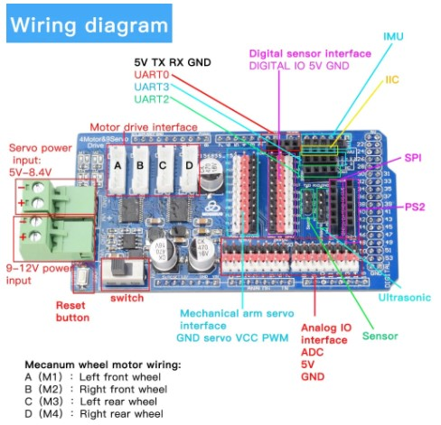
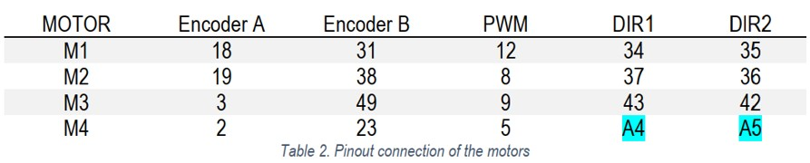

# **rUBot Mecanum driver**

Create a folder Arduino with all the installed libraries and code.

To test the functionality, we could create a first code to test de Odometry publishing:
- define a circle trajectory
- publish the tf frames of moving frame using tf.transform_broadcaster
- publish the Odometry messages in /odom topic

Create a first code program in arduino:
```python
// Rosserial pubsub exemple
#include <ros.h>
#include <ros/time.h>
#include <tf/tf.h>
#include <tf/transform_broadcaster.h>
#include <nav_msgs/Odometry.h>
#include <sensor_msgs/Range.h>
#include <geometry_msgs/Twist.h>

ros::NodeHandle  nh;
double x = 1.0;
double y = 0.0;
double theta = 1.57;
double vx = 0.0;
double w = 0.0;
char base_link[] = "/base_link";
char odom_link[] = "/odom";

void messageCb( const geometry_msgs::Twist& cmd_msg) {
  digitalWrite(13, HIGH-digitalRead(13));   // blink the led
  nh.loginfo("cmd_vel received!");
  vx=cmd_msg.linear.x;
  w=cmd_msg.angular.z;
  nh.loginfo("vel published!:");
  //nh.loginfo(vx);
  
}

ros::Subscriber<geometry_msgs::Twist> sub_vel("cmd_vel", messageCb );

sensor_msgs::Range range_msg;
ros::Publisher pub_range( "range_data", &range_msg);
nav_msgs::Odometry odom;
ros::Publisher odom_pub("odom", &odom);

geometry_msgs::TransformStamped t;
tf::TransformBroadcaster broadcaster;


void setup()
{
  pinMode(13, OUTPUT);
  nh.initNode();
  broadcaster.init(nh);
  nh.advertise(odom_pub);
  nh.advertise(pub_range);
  nh.subscribe(sub_vel);
}

void loop()
{
  // drive in a circle
  double dx = 0.2;
  double dtheta = 0.18;
  x += cos(theta)*dx*0.1;
  y += sin(theta)*dx*0.1;
  theta += dtheta*0.1;
  if(theta > 3.14)
    theta=-3.14;
    
  // tf odom->base_link
  t.header.frame_id = odom_link;
  t.child_frame_id = base_link;
  
  t.transform.translation.x = x;
  t.transform.translation.y = y;
  
  t.transform.rotation = tf::createQuaternionFromYaw(theta);
  t.header.stamp = nh.now();
  
  broadcaster.sendTransform(t);
  
  // Odom Publishing
  odom.header.stamp = nh.now();;
  odom.header.frame_id = "odom";
  odom.pose.pose.position.x = x;
  odom.pose.pose.position.y = y;
  odom.pose.pose.position.z = 0.0;
  odom.pose.pose.orientation =tf::createQuaternionFromYaw(theta);;

  odom.child_frame_id = "base_link";
  odom.twist.twist.linear.x = 3;
  odom.twist.twist.linear.y = 4;
  odom.twist.twist.angular.z = 5;
  //odom_pub.publish(&odom);

  // Range Publishing
  range_msg.range = 3;
  //pub_range.publish(&range_msg);
  
  nh.spinOnce();
  delay(50);
}
```
Open a terminal and type:
```shell
roscore
rosrun rosserial_python serial_node.py /dev/ttyACM0
```
You can see the Odom in rviz


## **2. Closed loop code**

This final code contains:
- Subscriber to /cmd_vel topic 
- Publisher to /odom topic
- Publisher to /imu topic

>Take care about:
>- Motor connections

>- Shield schematics

>- Pin number of encoders and PWM

>- When you want to test the program in ROS, you need to close the arduino IDE to make available the USB connection

The final code will be:

```python

#include <ros.h>
#include <ros/time.h>
#include <tf/tf.h>
#include <tf/transform_broadcaster.h>
#include <geometry_msgs/Twist.h>
#include <nav_msgs/Odometry.h>
#include<std_msgs/Bool.h>
//#include <WinsenZE03.h>
//WinsenZE03 sensor;  // sensor de ozo
#include"encoder.h"
#include"kinematics.hpp"
#include"motor.h"
#include"pid.hpp"
#include"imu.hpp"

//#define HDW_DEBUG  //aquesta opcio es per provar que envia correctament pel port serie les dades de la IMU i dels encodes, despres s'ha de desactivar  amb //

#if !defined(HDW_DEBUG)
ros::NodeHandle nh;
//ros::NodeHandle_<ArduinoHardware, 5, 5, 512, 1024> nh;
tf::TransformBroadcaster broadcaster;


#endif

float ctrlrate=1.0;
unsigned long lastctrl;
geometry_msgs::TransformStamped t;
geometry_msgs::Twist twist;
nav_msgs::Odometry odom;
ros::Publisher odom_pub("odom", &odom);

double x=0,y=0,theta=0;


float KP=0.3,KI=0.2,KD=0.2;
MPID PIDA(encA,KP,KI,KD,true);
MPID PIDB(encB,KP,KI,KD,false);
MPID PIDC(encC,KP,KI,KD,true);
MPID PIDD(encD,KP,KI,KD,false);

float wA,wB,wC,wD;

BMX055 Imu;

#if !defined(HDW_DEBUG)
void cmdVelCb( const geometry_msgs::Twist& twist_msg){
  float vx=twist_msg.linear.x;
  float vy=twist_msg.linear.y;
  float w=twist_msg.angular.z;

  float pwma=0,pwmb=0,pwmc=0,pwmd=0;
  InverseKinematic(vx,vy,w,pwma,pwmb,pwmc,pwmd);
  PIDA.tic();
  MotorA(PIDA.getPWM(pwma));
  wA=PIDA.getWheelRotatialSpeed();
  PIDA.toc();

  PIDB.tic();
  MotorB(PIDB.getPWM(pwmb));
  wB=PIDB.getWheelRotatialSpeed();
  PIDB.toc();

  PIDC.tic();
  MotorC(PIDC.getPWM(pwmc));
  wC=PIDC.getWheelRotatialSpeed();
  PIDC.toc();

  PIDD.tic();
  MotorD(PIDD.getPWM(pwmd));
  wD=PIDD.getWheelRotatialSpeed();
  PIDD.toc();

  lastctrl=millis();
}

void resetCb(const std_msgs::Bool& reset){
  if(reset.data){
    x=0.0;y=0.0;theta=0.0;
  }else{
    
  }
}

ros::Subscriber<geometry_msgs::Twist> sub("cmd_vel", cmdVelCb );
ros::Subscriber<std_msgs::Bool> resub("rest_odom", resetCb );
#endif

void setup()
{
  #if defined(HDW_DEBUG)
	Serial.begin(57600);
  
  pinMode (2,OUTPUT);
  pinMode (3,OUTPUT);
  pinMode (4,OUTPUT);
  pinMode (5,OUTPUT);
 digitalWrite(2, HIGH);
 digitalWrite(3, LOW);
 digitalWrite(4, LOW);
 digitalWrite(5, LOW);

 
  Serial3.begin(9600);
  //sensor.begin(&Serial3, CO);
  //sensor.setAs(QA);
 #endif
	IO_init();
  PIDA.init();
  PIDB.init();
  PIDC.init();
  PIDD.init();
//  Imu.SetupDevice();
  #if !defined(HDW_DEBUG)
  nh.initNode();
  broadcaster.init(nh);
  nh.subscribe(sub);
  nh.subscribe(resub);
  nh.advertise(odom_pub);
  lastctrl=millis();
  #endif
}

void loop(){
  float ax,ay,az,gx,gy,gz;
  delay(10);

  float vxi=0,vyi=0,omegai=0;
  ForwardKinematic(wA,wB,wC,wD,vxi,vyi,omegai);
  //float ppm = sensor.readManual();
  float dt=PIDA.getDeltaT();
  x+=vxi*cos(theta)*dt-vyi*sin(theta)*dt;
  y+=vxi*sin(theta)*dt+vyi*cos(theta)*dt;
  theta+=omegai*dt;
  if(theta > 3.14)
    theta=-3.14;
//                        TODO IMU
 Imu.getGyro(gx,gy,gz);
Imu.getAcc(ax,ay,az);
#if defined(HDW_DEBUG)
Serial.print("ACC:  x: ");
Serial.print(ax);
Serial.print(" y: ");
Serial.print(ay);
Serial.print(" z: ");
Serial.println(az);

Serial.print("GRYO:  x: ");
Serial.print(gx);
Serial.print(" y: ");
Serial.print(gy);
Serial.print(" z: ");
Serial.println(gz);

#endif

  #if !defined(HDW_DEBUG)

 t.header.frame_id = "odom";
 t.child_frame_id = "base_link";
  
  t.transform.translation.x = x;
  t.transform.translation.y = y;
  
  t.transform.rotation = tf::createQuaternionFromYaw(theta);
  t.header.stamp = nh.now();
  
  broadcaster.sendTransform(t);

  
  odom.header.stamp = nh.now();;
  odom.header.frame_id = "odom";
  odom.pose.pose.position.x = x;
  odom.pose.pose.position.y = y;
  odom.pose.pose.position.z = 0.0;
  odom.pose.pose.orientation =tf::createQuaternionFromYaw(theta);;

  odom.child_frame_id = "base_link";
  odom.twist.twist.linear.x = vxi;
  odom.twist.twist.linear.y = vyi;
  odom.twist.twist.angular.z = omegai;

  //odom_pub.publish(&odom);


  if((millis()-lastctrl)>1000*ctrlrate){
    STOP();
  }
  nh.spinOnce();
  #endif
 
}
```
To publish a cmd_vel, type:
```shell
rostopic pub -r 1 /cmd_vel geometry_msgs/Twist '[2, 0, 0]' '[0, 0, 2]'
```
