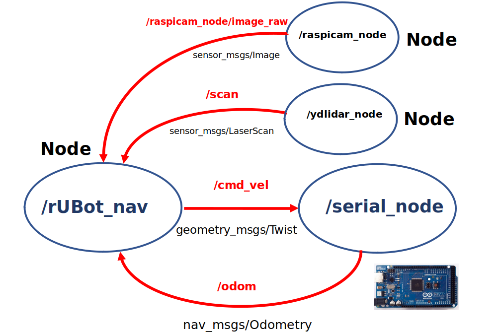

# **rUBot mecanum in Raspberrypi4 Control**

The main objectives are to control the rUBot movements:
- self navigation
- follow wall
- go to pose

### **Setup your workspace**
The raspberrypi4 onboard is preinstalled with:
- Ubuntu 20 server 32bits
  - NoMachine remote desktop
- ROS Noetic
- rubot_rbpi4_ws repository is located in /home/pi/Desktop folder 

We will create a "rubot_control" package to perform the rUBot_mecanum control movements:
```shell
cd ~/Desktop/rubot_rbpi4_ws/src
catkin_create_pkg rubot_control rospy std_msgs sensor_msgs geometry_msgs nav_msgs
cd ..
catkin_make
```
>Carefull!: Some actions have to be done:
>- review the ~/.bashrc: source to the ws and delete the environment variables
>- make executable the python files

First of all you need to bringup the rubot_mecanum robot.

### **Bringup rubot_mecanum**

The bringup consists to:
- launch the rUBot node in Arduino-Mega board
- launch the LIDAR node
- launch the raspicam node

You will launch first "rubot_bringup_hw.launch" file to setup the rUBot_mecanum.

```shell
roslaunch rubot_control rubot_bringup_hw.launch
```

### **Movement control using keyboard**

To control the gopigo robot with keyboard, we need to install "teleop_tools" package. Open a new terminal and install the packages:
```shell
sudo apt-get install ros-noetic-teleop-tools
sudo apt-get install ros-noetic-teleop-twist-keyboard
```
Proceed with:
- Bringup rUBot_mecanum
```shell
roslaunch rubot_control rubot_bringup_hw.launch
```
- Then open a new terminal and type:
```shell
rosrun key_teleop key_teleop.py /key_vel:=/cmd_vel
or
rosrun teleop_twist_keyboard teleop_twist_keyboard.py
```

## **Movement control with python script**

From the "rubot_rbpi4_ws" workspace, the src/rubot_control folder has 2 new folders:
- scrip folder: with the python programs for specific movement control
- launch folder: with programs to launch the movement control

Diferent navigation programs are created:

- Navigation control: to define a desired robot velocity
- Lidar test: to verify the LIDAR readings and angles
- Autonomous navigation: to perform a simple algorithm for navigation with obstacle avoidance using the LIDAR
- Wall follower: at a fixed distance to perform a good map
- go to POSE: attend a specific position and orientation

The nodes and topics structure corresponds to the following picture:


### **a) Navigation control**

We have created a first navigation python files in "src" folder:

- rubot_nav.py: to define the movement with vx, vy and w to reach a maximum distance in x or y

A "node_nav.launch" file is created to launch the node and python file created above.

To properly perform a especific movement control we have first to:
- Bringup rUBot_mecanum
```shell
roslaunch rubot_control rubot_bringup_hw.launch
```
- Then open a new terminal to launch the rUBot_nav node to perform the specific movement control.
```shell
roslaunch rubot_control rubot_nav.launch
```

### **b) LIDAR test**

In order to navigate autonomously and avoid obstacles, we will use a specific rpLIDAR sensor. To verify the LIDAR readings and angles we have generated the "rubot_lidar_test.py" python file:

To properly perform a especific movement control we have first to:
- Bringup rUBot_mecanum
```shell
roslaunch rubot_control rubot_bringup_hw.launch
```
- Then open a new terminal to launch the rUBot_nav node to perform the rpLIDAR test. We have created specific python file and launch file for this test control
```shell
roslaunch rubot_control rubot_lidar_test.launch
rosrun teleop_twist_keyboard teleop_twist_keyboard.py
```

### **c) Autonomous navigation and obstacle avoidance**

Using rpLIDAR sensor you can perform the autonomous navigation avoiding obstacles.

This performance is defined in "rubot_self_nav.py"

To properly perform a especific self-navigation control we have first to:
- Bringup rUBot_mecanum
```shell
roslaunch rubot_control rubot_bringup_hw.launch
```
- Then open a new terminal to launch the rUBot_nav node to perform the self-navigation. We have created specific python file and launch file for this navigation control
```shell
roslaunch rubot_control rubot_self_nav.launch
```
The launch file contains some parameters you can modify:
```xml
<launch>
  <!-- launch obstacle avoidance   -->
    <arg name="distance_laser" default="0.3" />
    <arg name="speed_factor" default="0.1"/>
    <arg name="forward_speed" default="2" />
    <arg name="backward_speed" default="-1" />
    <arg name="rotation_speed" default="20" />
    <node name="rubot_nav" pkg="rubot_control" type="rubot_self_nav.py" output="screen" >
        <param name="distance_laser" value="$(arg distance_laser)"/>
        <param name="speed_factor" value="$(arg speed_factor)"/>
        <param name="forward_speed" value="$(arg forward_speed)"/>
        <param name="backward_speed" value="$(arg backward_speed)"/>
        <param name="rotation_speed" value="$(arg rotation_speed)"/>
    </node>    
</launch>
```
In order to see the rubot with the topics information we will use rviz. Open rviz in a new terminal.

In rviz, select the fixed frame to "odom", and add Camera and LaserScan with the corresponding topics names.

You can then save the config file as laserscan.rviz name and use it in the launch file


A launch file is created to integrate all the needed roslaunch parameters but you can change the defauld values with this syntax:
```shell
roslaunch rubot_control rubot_self_nav.launch distance_laser:=0.5 speed_factor:=0.5
```
### **D) Wall Follower**

This control task consist on find a wall and follow it at a certain distance. We will see that this is an important control task because this will be used later to make accurate maps of working environments.

We have developed 2 different methods for wall follower:
- Geometrical method
- Lidar ranges method

#### **Geometrical method**
In src folder you create the python file for wall follower purposes

The instructions to perform the python program are in the notebook: 

https://github.com/Albert-Alvarez/ros-gopigo3/blob/lab-sessions/develop/ROS%20con%20GoPiGo3%20-%20S4.md


To properly perform a especific self-navigation control we have first to:
- Bringup rUBot_mecanum
```shell
roslaunch rubot_control rubot_bringup_hw.launch
```
- Then open a new terminal to launch the rUBot_nav node to perform the wall-follower. We have created specific python file and launch file for this navigation control
```shell
roslaunch rubot_control rubot_wall_follower_gm.launch
```
The launch file contains different parameters you can modify:
```xml
<launch>
  <!-- launch follow wall   -->
  <arg name="kp" default="5" />
  <arg name="distance_reference" default="0.3" />
  <arg name="lookahead_distance" default="0.4" />
  <arg name="forward_speed" default="0.04" />
  <arg name="theta" default="50.0" />
  <node name="wall_follower_controller" pkg="gopigo_control" type="rubot_wall_follower_gm.py" output="screen" >
    <param name="kp" value="$(arg kp)"/>
    <param name="distance_reference" value="$(arg distance_reference)"/>
    <param name="lookahead_distance" value="$(arg lookahead_distance)"/>
    <param name="forward_speed" value="$(arg forward_speed)"/>
    <param name="theta" value="$(arg theta)"/>
  </node>
</launch>
```
You can see the video result:

[](https://youtu.be/z5sAyiFs-RU)

#### **b) ranges method**
In src folder you create the python file for wall follower purposes

The algorith is based on laser ranges test and depends on the LIDAR type:


Take into account that:
- RP LIDAR has 180º rotation
- YDlidar in front direction has 2 different ranges [660:719] and [0:60]
- YDlidar sends some 0 values due to wrong readings. They have to be changed to high value to be able to take the minimum falue from the desired range.

To properly perform a especific self-navigation control we have first to:
- Bringup rUBot_mecanum
```shell
roslaunch rubot_control rubot_bringup_hw.launch
```
- Then open a new terminal to launch the rUBot_nav node to perform the wall-follower. We have created specific python file and launch file for this navigation control
```shell
roslaunch rubot_control rubot_wall_follower_rg.launch
```
The launch file has no parameters to modify:

```xml
<launch>
  <!-- launch follow wall   -->
  <node name="wall_follow" pkg="rubot_control" type="rubot_wall_follower_rg.py" output="screen" >
  </node>
</launch>
```
### **E) Go to POSE**

The objective is to program the robot to reach a speciffic target POSE defining:
- x position
- y position
- angle orientation (from 0º to 180º)

To properly perform a especific self-navigation control we have first to:
- Bringup rUBot_mecanum
```shell
roslaunch rubot_control rubot_bringup_hw.launch
```
- Then open a new terminal to launch the rUBot_nav node to perform the go 2 pose control. We have created specific python file and launch file for this navigation control
```shell
roslaunch rubot_control rubot_go2pose.launch
```
The launch file has no parameters to modify:

```xml
<launch>
<!-- run navigation program  -->
    <arg name="x" default="0.7"/>
    <arg name="y" default="0.7"/>
    <arg name="f" default="120"/>
    <node pkg="nexus_control" type="rubot_go2pose.py" name="nexus_control" output="screen" >
      <param name="x" value="$(arg x)"/>
      <param name="y" value="$(arg y)"/>
      <param name="f" value="$(arg f)"/>
    </node>
</launch>
```
