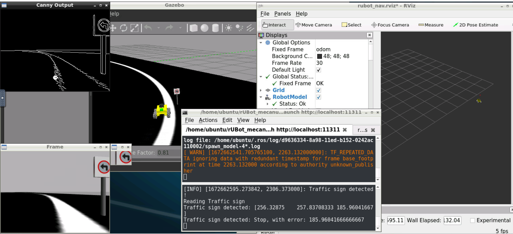
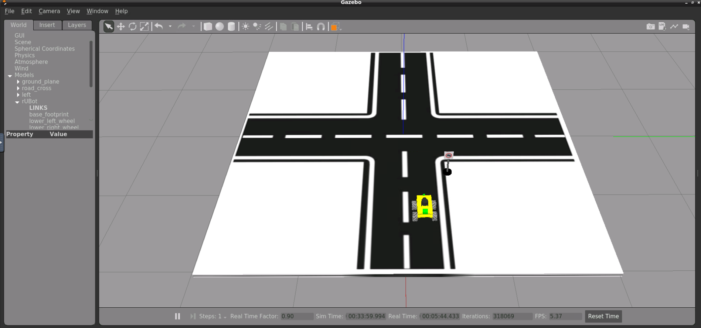

# **rUBot mecanum challenging projects**

The projects proposed will be based on:

- rUBot navigation using python-based code
- Video and picture caption
- Image processing

The different projects will be:

- 1. rUBot takes photo
- 2. Go to specific point in the map
- 3. Go to specific point in the map and take a photo
- 4. Line follower

The image processing projects will be performed using:

- 2D raspicam
- 3D Inter Realsense camera

References OpenCV:

- http://wiki.ros.org/cv_bridge/Tutorials/ConvertingBetweenROSImagesAndOpenCVImagesPython
- https://docs.opencv.org/4.x/d6/d00/tutorial_py_root.html
- https://github.com/Akshay594/OpenCV/tree/master/tutorials

References InterRealSense:

- https://dev.intelrealsense.com/docs/ros-wrapper
- https://www.youtube.com/watch?v=GhHvuAoFC6I
- https://intel.github.io/robot_devkit_doc/pages/rs_slam.html

References for webcam:

- https://automaticaddison.com/working-with-ros-and-opencv-in-ros-noetic/

References:

- https://learn.turtlebot.com/
- https://learn.turtlebot.com/2015/02/04/1/
- https://learn.turtlebot.com/2015/02/04/2/
- https://learn.turtlebot.com/2015/02/04/3/
- https://github.com/markwsilliman/turtlebot
- http://wiki.ros.org/Camera%2BDynamixelRobotSample/CameraPictureServer
- https://industrial-training-master.readthedocs.io/en/melodic/_source/session5/OpenCV-in-Python.html

The first step is to create a new package "rubot_projects" with dependencies:

- rospy
- sensor_msgs
- std_msgs
- cv_bridge

```shell
catkin_create_pkg rubot_projects rospy std_msgs sensor_msgs cv_bridge
```

This package is already created and ready to use it!. You have not to create it.

We will perform some specific projects related to rUBot vision capabilities in a navigation process.

## **1. rUBot takes photo**

The objective is to program a python code to take a photo using raspicam in gopigo3 robot prototype.

Important information is taken from: https://learn.turtlebot.com/2015/02/04/3/

Follow the procedure:

- Identify the topic name where raspicam publishes the photo as a mesage of type sensor_msgs:

```shell
roslaunch nexus_slam rubot_world.launch 
rostopic list
```

- Then modify the "take_photo.py" python file with:
  - the proper topic name /usb_cam/image_raw
  - the proper photo filename in folder path: ./src/rubot_projects/photos/photo_sim.jpg
- run the "take_photo.py" python file to take a photo

```shell
rosrun rubot_projects take_photo.py
```

- Open the "photos" folder and you will see the photo1.jpg created


## **2. Go to specific point in the map**

In this project we will learn how to send robot a command: “go to a specific position at map”.

The program is extracted from:

- https://github.com/markwsilliman/turtlebot
- https://learn.turtlebot.com/2015/02/03/11/

For this purpose we need to use the **move_base node**. This node:

- subscribes to move_base_simple/goal (geometry_msgs/PoseStamped)
- publishes to cmd_vel (geometry_msgs/Twist)


Follow the procedure:

- Launch Gazebo:

  ```shell
  roslaunch nexus_slam rubot_world.launch
  ```
- Launch the navigation:

  ```shell
  roslaunch nexus_slam rubot_navigation.launch
  ```
- Choose a target point in RVIZ using "Publish point" and select the target coordinates (i.e. x=2.0 y=-0.7)
- open "go_to_specific_point_on_map.py" and specify the target point

  - in line 78 specify the target point, customize the following values so they are appropriate for your location
    - position = {'x': 2.0, 'y' : -0.7}
- Launch the "go_to_specific_point_on_map.py" program:

  ```shell
  rosrun rubot_projects go_to_specific_point_on_map.py
  ```


## **3. Go to specific point in the map and take a photo**

We will combine our skills from two previous objectives:

- “Going to a Specific Location on Your Map Using Code”
- and “Taking a Photo Using Code”.

The rUBot will go from the start to each goal from the list and take a photo in every position.

We will work with the files from: https://github.com/markwsilliman/turtlebot

Follow the instructions in: https://learn.turtlebot.com/2015/02/04/5/

We use the code go_to_specific_point_on_map.py and take_photo.py from previous exemples.

We have generated  the python file **"Follow_the_route.py"** that reads input data from "route.yaml" file.

The YAML file has three lines. It means that there are three goals. Look on the first line:

- {filename: 'photo1.png', position: { x: 0.355, y: -0.2}, quaternion: {r1: 0, r2: 0, r3: -0.628, r4: 0.778}}

  The dumpster.png is the image title for picture.

  The position and quaternion set the goal: the place where rUBot takes a photo.

The objective is to follow the route and take pictures.

Proceed with the following steps:

- Launch Gazebo:

  ```shell
  roslaunch nexus_slam rubot_world.launch
  ```
- Run the navigation demo:

  ```shell
  roslaunch nexus_slam rubot_navigation.launch
  ```
- Specify a "route.yaml" file with the points to follow and take photo:

  - {filename: './src/robot_projects/rubot_projects/photos/picture1.png', position: { x: -0.3, y: -0.8}, quaternion: {r1: 0, r2: 0, r3: -0.628, r4: 0.778}}
  - {filename: './src/robot_projects/rubot_projects/photos/picture2.png', position: { x: 1.7, y: -0.7}, quaternion: {r1: 0, r2: 0, r3: 0.936, r4: 0.353}}
  - {filename: './src/robot_projects/rubot_projects/photos/picture3.png', position: { x: 1.7, y: 0.5}, quaternion: {r1: 0, r2: 0, r3: 0.904, r4: -0.427}}
- Open a terminal in the ldestination of pictures and launch the "follow_the_route.py" program:

  ```shell
  rosrun rubot_projects follow_the_route.py
  ```

> Careful!:
> Be sure to execute the rosrun instruction inside the "rubot_mecanum_ws" folder. Review the the absolute path or relative path to the yaml file and the picture path destination.


Improvement!:

- a modified "follow_the_route2.py" and "route2.yaml" is made in order to insert the target orientation in RPY degrees
  - {filename: './src/gopigo3_projects/photos/room11.png', position: { x: -0.3, y: -0.8}, angle: {fi: -90}}
  - {filename: './src/gopigo3_projects/photos/room22.png', position: { x: 1.7, y: -0.7}, angle: {fi: 0}}
  - {filename: './src/gopigo3_projects/photos/room33.png', position: { x: 1.7, y: 0.5}, angle: {fi: 0}}

Launch the "follow_the_route.py" program:

    rosrun rubot_projects follow_the_route2.py

## **4. Line following**

Detailed official information in:

- https://www.theconstructsim.com/morpheus-chair-create-a-linefollower-with-rgb-camera-and-ros-episode-5/
- https://www.youtube.com/watch?v=9C7Q8bRERgM
- https://github.com/noshluk2/ROS2-Self-Driving-Car-AI-using-OpenCV

Related to the links:

- http://www.rosject.io/l/8292943/
- https://en.wikipedia.org/wiki/Differential_wheeled_robot

And with the code:

- https://bitbucket.org/theconstructcore/morpheus_chair/src/master/

The nexts steps will be:

- Define a proper simulated world in Gazebo
- spawn the robot model in Gazebo world
- setup the robot with camera
- start the line follower node

### **4.1. world setup**

We have created different models to include in gazebo world:

- Trafic signs
- lights
- road

We will construct first these models in a specific folder:

- .../rubot_mecanum_ws/src/rubot_mecanum_description/models

We have to add this folder to GAZEBO_MODEL_PATH tenvironment variable. This is done either:

- When using ROS in UBUNTU: in ~/.bashrc file adding this line:

```xml
export GAZEBO_MODEL_PATH=/home/rUBot_mecanum_ws/src/rubot_mecanum_description/models:$GAZEBO_MODEL_PATH
```

> If you want to delete any model path from gazebo, load the "gui.ini" file from .gazebo folder. There is a list of model paths and you can delete the one you do not want

- When using ROS in WINDOWS, add in Terminal "command line":

```xml
&& set GAZEBO_MODEL_PATH=C:\Usuarios\puigm\Escritorio\ROS_github\rUBot_mecanum_ws\src\rubot_mecanum_description\models
```

- or copy the models folder in ~/.gazebo/models/
- or you have this folder already in your Gazebo Path if you have created a model using "Building Editor"

#### **a) Custom model: Traffic sign**

Let's create a "sign board 30" model:

- Open Gazebo as superuser (sudo gazebo)
- select edit --> Model Editor
- add the meshes (obj files or standard objects) needed to create the sign model
- adjust the size and place the objects in the correct positions to be assembled
- select joint in gazebo (fixed), define the parent and child links, adjust the relative pose, change the joint name if you want and create the model
- save the model as "sign_stand"
- You will see the folder created for this model with 2 files (model.config and model.sdf)
- in model.sdf you can:
  - reduce the mass of the upper links for inertial stability.
  - change the defauld color (Gazebo/Grey)
  - change the dimensions and pose of different links if necessary
- open gazebo and add the generated model to verify the size and mecanical stability.

This model will be used to create all the other traffic signs, for exemple the turn traffic sign:

- Make a copy of this folder with the name "sign_left_turn"
- in model.config file change the name to "sign_left_turn"
- add materials and meshes folders inside "sign_left_turn"
- In materials folder add scripts and textures folder
- In textures folder add the png file with the sign picture (turn.png)
- in scripts add a sign_left_turn.material file with this contents (specify the turn.png file):

```xml
material sign_left_turn/Diffuse
{
  technique
  {
    pass
    {
      texture_unit
      {
        texture turn.png
        filtering anistropic
        max_anisotropy 16
      }
    }
  }
}
```

- Open the model.sdf and change the material properties of link02 where we want to place the turn left texture. Replace the text:

```xml
        <material>
          <lighting>1</lighting>
          <script>
            <uri>file://media/materials/scripts/gazebo.material</uri>
            <name>Gazebo/White</name>
          </script>
          <shader type='pixel'/>
          <emissive>0 0 0 1</emissive>
        </material>
```

by this text:

```xml
        <material>
          <script>
            <uri>model://sign_left_turn/materials/scripts</uri>
            <uri>model://sign_left_turn/materials/textures</uri>
            <name>sign_left_turn/Diffuse</name>
          </script>
        </material>
```

- you have now the turn traffic sign ready!

#### **b) Road  (windows)**

Let's create road surface to follow the road line:

- Open Gazebo (roslaunch gazebo_ros empty_world.launch) and in Building Editor create a model "road1" using a wall with height 5cm width 10m and length 10m. Save this model in "rUBot_mecanum_ws\src\rubot_mecanum_description\models"
- In Power point, create a picture with the road desired texture (proportional xy size is important).
- Save this picture in pgn ot jpeg format using for exemple "Recorte" from windows
- copy the png file to package folder C:/opt/ros/noetic/x64/share/gazebo-10/media/materials/textures
- open package file "C:/opt/ros/noetic/x64/share/gazebo-10/media/materials/scripts/gazebo.material"
- add this code at the end (with png file name):

```xml
material Gazebo/Road_custom
{
  technique
  {
    pass
    {
      ambient 1.0 1.0 1.0 1.0
      diffuse 1.0 1.0 1.0 1.0
      specular 0.2 0.2 0.2 1.0 12.5

      texture_unit
      {
        texture road_custom_1.png
        filtering trilinear
      }
    }
  }
}
```

- Some models and textures are in "rUBot_mecanum_ws/Documentation/Files/Model_Textures/"
- In the "road1" created model ("rUBot_mecanum_ws\src\rubot_mecanum_description\models\road1"), open "model.sdf"
- Change the material/script lines to:

```xml
<material>
  <script>
    <uri>file://media/materials/scripts/gazebo.material</uri>
    <name>Gazebo/Road_custom</name>
  </script>
```

- Open a gazebo_empty-world and create your road_custom_1.world file using the defined models

#### **c) final world**

To add models in our world add each model in the last part of your world file (here starts with empy.world):

```xml
<sdf version="1.5">
  <world name="default">
    <!-- A global light source -->
    <include>
      <uri>model://sun</uri>
    </include>
    <!-- A ground plane -->
    <include>
      <uri>model://ground_plane</uri>
    </include>
    <!-- A traffic sign -->
    <include>
      <uri>model://sign_left_turn</uri>
      <pose>0 0 0.5 0 0 0</pose>
    </include>
    <!-- Line Test 1 -->
    <include>
        <uri>model://line2</uri>
        <name>line_1</name>
        <pose>0 0 0 0 0 0</pose>
      </include> 
    <!-- Line Test 2 -->
    <include>
        <uri>model://line2</uri>
        <name>line_2</name>
        <pose>1 1.025 0 0 0 1.57</pose>
    </include> 
  </world>
</sdf>
```

Alternativelly you can open gazebo and add the desired models in proper location and save it in world format.

```shell
roslaunch gazebo_ros empty_world.launch
```

### **4.2. Simple line follower**

We spawn our robot into gazebo world:

```shell
roslaunch rubot_projects rubot_bringup.launch
```

To see the camera image, type:

```shell
rosrun rqt_image_view rqt_image_view
```

Start the node line_following_sim

```shell
roslaunch rubot_projects line_following_traffic.launch
```


### **4.3. Traffic road follower**

We spawn our robot into gazebo world:

```shell
roslaunch rubot_projects rubot_bringup.launch
```

To see the camera image, type:

```shell
rosrun rqt_image_view rqt_image_view
```

Start the node line_following_sim

```shell
roslaunch rubot_projects line_following_traffic.launch
```





Image comparison:
https://www.tutorialspoint.com/how-to-compare-two-images-in-opencv-python

Color detection:
https://techvidvan.com/tutorials/detect-objects-of-similar-color-using-opencv-in-python/

Square detection:
https://www.tutorialspoint.com/how-to-detect-a-rectangle-and-square-in-an-image-using-opencv-python
