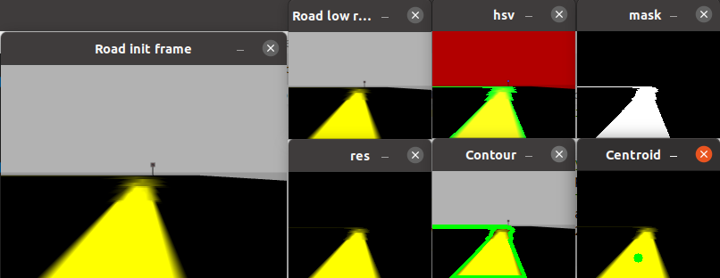

# **rUBot mecanum challenging projects**

The projects proposed will be based on:

- Video and picture caption
- rUBot navigation with Image processing

The different projects will be:

- 1. rUBot takes photo
- 2. Go to specific point in the map and take a photo
- 4. Line follower

References OpenCV:

- http://wiki.ros.org/cv_bridge/Tutorials/ConvertingBetweenROSImagesAndOpenCVImagesPython
- https://docs.opencv.org/4.x/d6/d00/tutorial_py_root.html
- https://github.com/Akshay594/OpenCV/tree/master/tutorials

References InterRealSense:

- https://dev.intelrealsense.com/docs/ros-wrapper
- https://www.youtube.com/watch?v=GhHvuAoFC6I
- https://intel.github.io/robot_devkit_doc/pages/rs_slam.html

References for webcam:

- https://automaticaddison.com/working-with-ros-and-opencv-in-ros-noetic/

References:

- https://learn.turtlebot.com/
- https://learn.turtlebot.com/2015/02/04/1/
- https://learn.turtlebot.com/2015/02/04/2/
- https://learn.turtlebot.com/2015/02/04/3/
- https://github.com/markwsilliman/turtlebot
- http://wiki.ros.org/Camera%2BDynamixelRobotSample/CameraPictureServer
- https://industrial-training-master.readthedocs.io/en/melodic/_source/session5/OpenCV-in-Python.html

The first step is to create a new package "rubot_projects" with dependencies:

- rospy
- sensor_msgs
- std_msgs
- cv_bridge

```shell
catkin_create_pkg rubot_projects rospy std_msgs sensor_msgs cv_bridge
```

This package is already created and ready to use it!. You have not to create it.

We will perform some specific projects related to rUBot vision capabilities in a navigation process.

## **Project 1: rUBot takes photo**

The objective is to program a python code to take a photo using usb-cam in robot prototype.

Important information is taken from: https://learn.turtlebot.com/2015/02/04/3/

Follow the procedure:

- Identify the topic name where raspicam publishes the photo as a mesage of type sensor_msgs:

```shell
roslaunch rubot_slam rubot_slam_bringup_sw.launch 
rostopic list
```

- Then modify the "take_photo.py" python file with:
  - the proper topic name /rubot/camera1/image_raw
  - the proper photo filename in folder path: ./src/rubot_projects/photos/photo_sim.jpg
- run the "take_photo.py" python file to take a photo

```shell
rosrun rubot_projects take_photo.py
```

- Open the "photos" folder and you will see the photo1.jpg created


## **Project 2: Navigate to a sequence of goals in the map and take a photo**

We will combine the two programs:

- Send a sequence of goals to navigation stack
- Take a Photo 

We will take a "goals_foto.yaml" file to specify the POSE goal and Photo path-name.


We use the code go_to_specific_point_on_map.py and take_photo.py from previous exemples.

We have generated  the python file **"Follow_the_route.py"** that reads input data from "route.yaml" file.

The YAML file has three lines. It means that there are three goals. Look on the first line:

- {filename: 'photo1.png', position: { x: 0.355, y: -0.2}, quaternion: {r1: 0, r2: 0, r3: -0.628, r4: 0.778}}

  The dumpster.png is the image title for picture.

  The position and quaternion set the goal: the place where rUBot takes a photo.

The objective is to follow the route and take pictures.

Proceed with the following steps:

- Launch Gazebo:

  ```shell
  roslaunch nexus_slam rubot_world.launch
  ```
- Run the navigation demo:

  ```shell
  roslaunch nexus_slam rubot_navigation.launch
  ```
- Specify a "route.yaml" file with the points to follow and take photo:

  - {filename: './src/robot_projects/rubot_projects/photos/picture1.png', position: { x: -0.3, y: -0.8}, quaternion: {r1: 0, r2: 0, r3: -0.628, r4: 0.778}}
  - {filename: './src/robot_projects/rubot_projects/photos/picture2.png', position: { x: 1.7, y: -0.7}, quaternion: {r1: 0, r2: 0, r3: 0.936, r4: 0.353}}
  - {filename: './src/robot_projects/rubot_projects/photos/picture3.png', position: { x: 1.7, y: 0.5}, quaternion: {r1: 0, r2: 0, r3: 0.904, r4: -0.427}}
- Open a terminal in the ldestination of pictures and launch the "follow_the_route.py" program:

  ```shell
  rosrun rubot_projects follow_the_route.py
  ```

> Careful!:
> Be sure to execute the rosrun instruction inside the "rubot_mecanum_ws" folder. Review the the absolute path or relative path to the yaml file and the picture path destination.


Improvement!:

- a modified "follow_the_route2.py" and "route2.yaml" is made in order to insert the target orientation in RPY degrees
  - {filename: './src/gopigo3_projects/photos/room11.png', position: { x: -0.3, y: -0.8}, angle: {fi: -90}}
  - {filename: './src/gopigo3_projects/photos/room22.png', position: { x: 1.7, y: -0.7}, angle: {fi: 0}}
  - {filename: './src/gopigo3_projects/photos/room33.png', position: { x: 1.7, y: 0.5}, angle: {fi: 0}}

Launch the "follow_the_route.py" program:

    rosrun rubot_projects follow_the_route2.py

## **4. Object Detection & tracking**

Detailed official information in:

- https://opencv24-python-tutorials.readthedocs.io/en/latest/py_tutorials/py_imgproc/py_colorspaces/py_colorspaces.html
- https://opencv24-python-tutorials.readthedocs.io/en/latest/py_tutorials/py_imgproc/py_contours/py_contours_begin/py_contours_begin.html
- https://opencv24-python-tutorials.readthedocs.io/en/latest/py_tutorials/py_imgproc/py_contours/py_contour_features/py_contour_features.html
- https://www.peko-step.com/es/tool/hsvrgb.html

The objective of this project is:

- From an image obtained with raspicam
- Detect the yelow line
- identify the contours
- obtain the center of mass (centroids from moments)

In HSV, it is more easier to represent a color than RGB color-space.


**a) Obtain a camera image**

Locate the robot in the Gazebo simulated environment.

```shell
roslaunch rubot_projects rubot_bringup.launch
rosrun rqt_image_view rqt_image_view
```

Save an image to work with. The choosen image is:


**b) Detect the yelow line centroid **

We will try to detect the yelow line. So here is the method:

- Convert from BGR to HSV color-space
- We threshold the HSV image for a range of yelow color
- Now extract the yelow object alone,
- detect the countour
- obtain the moments
- extract the centroid

We have created a python function to convert RGB i HSV color code. To test it type and choose the RGB color to convert to HSV code:

```shell
rosrun rubot_projects rgb_hsv.py
```

Below is the code which are commented in detail :

```python
#!/usr/bin/env python3

import cv2
import numpy as np

# terminal in the png folder
# yelow line detection RGB=(255,255,0) or BGR=(0,255,255)
frame = cv2.imread("road_view1.png", cv2.IMREAD_COLOR)
cv2.imshow("Road init frame", frame)
height, width, channels = frame.shape
print("shape frame: width {1} height {0}".format(height,width))
frame2 = cv2.resize(frame, (0, 0), fx=0.5, fy=0.5)#half resolution
height, width, channels = frame2.shape
print("shape frame2: width {1:.0f} height {0:.0f}".format(height,width))
# Convert BGR to HSV. Yelow HSV = [30, 255, 255]
hsv = cv2.cvtColor(frame2, cv2.COLOR_BGR2HSV)
cv2.imshow("hsv", hsv)
# Define range of yelow color in HSV
# Take red H range: fom 27 to 33 
# Take S range: from 100 to 255 (for white from 0)
# Tahe V range: from 20 to 255 (for white from 0)
lower_color = np.array([27,100,20])
upper_color = np.array([33,255,255])
# Threshold the HSV image to get only yelow color zone in B&W image
mask = cv2.inRange(hsv, lower_color, upper_color)
# Bitwise-AND mask and original image to obtain the image with only yelow regions
res = cv2.bitwise_and(frame2,frame2, mask= mask)
cv2.imshow('Road low resolution',frame2)
cv2.imshow('mask',mask)
cv2.imshow('res',res)
# Find Contours
(contours, _) = cv2.findContours(mask, cv2.RETR_TREE, cv2.CHAIN_APPROX_SIMPLE)
print("Number of centroids==>" + str(len(contours)))
cv2.drawContours(frame2,contours,-1,(0,255,0),3)
cv2.imshow('Contour',frame2)
# Find Centroids
M = cv2.moments(contours[0])
cx = int(M['m10']/M['m00'])
cy = int(M['m01']/M['m00'])
cv2.circle(res, (int(cx), int(cy)), 5, (0, 255, 0), -1)
cv2.imshow("Centroid", res)
print("Centroid: ({0},{1})".format(cx,cy))       
# Wait until x miliseconds or until you close all windows (0)
cv2.waitKey(0)
#cv2.destroyAllWindows()
```



Type from road.png folder:

```hell
rosrun rubot_projects color_detection.py
```

> Note the origin image is in top-left corner

## **5. Line follower**

Important information can be obtained here:

- https://www.theconstructsim.com/morpheus-chair-create-a-linefollower-with-rgb-camera-and-ros-episode-5/
- https://www.youtube.com/watch?v=9C7Q8bRERgM
- https://github.com/noshluk2/ROS2-Self-Driving-Car-AI-using-OpenCV

Related to the links:

- http://www.rosject.io/l/8292943/
- https://en.wikipedia.org/wiki/Differential_wheeled_robot

And with the code:

- https://bitbucket.org/theconstructcore/morpheus_chair/src/master/

The nexts steps will be:

- Define a proper simulated world in Gazebo
- spawn the robot model in Gazebo world
- setup the robot with camera
- start the line follower node

### **4.1. world setup**

We have created different models to include in gazebo world:

- Trafic signs
- lights
- road

We will construct first these models in a specific folder:

- /media/sf_github_manelpuig/rubot_mecanum_ws/src/robot_projects/rubot_projects/models

We have to add this folder to GAZEBO_MODEL_PATH tenvironment variable. This is done either:

- in ~/.bashrc file adding this line:

```xml
export GAZEBO_MODEL_PATH=$HOME/Escritorio/rUBot_mecanum_ws/src/rubot_projects/models:$GAZEBO_MODEL_PATH
```

> If you want to delete any model path from gazebo, load the "gui.ini" file from .gazebo folder. There is a list of model paths and you can delete the one you do not want

- or copy the models folder in ~/.gazebo/models/

#### **a) Traffic sign**

Let's create a "sign board 30" model:

- Open Gazebo as superuser (sudo gazebo)
- select edit --> Model Editor
- add the meshes (obj files or standard objects) needed to create the sign model
- adjust the size and place the objects in the correct positions to be assembled
- select joint in gazebo (fixed), define the parent and child links, adjust the relative pose, change the joint name if you want and create the model
- save the model as "sign_stand"
- You will see the folder created for this model with 2 files (model.config and model.sdf)
- in model.sdf you can:
  - reduce the mass of the upper links for inertial stability.
  - change the defauld color (Gazebo/Grey)
  - change the dimensions and pose of different links if necessary
- open gazebo and add the generated model to verify the size and mecanical stability.

This model will be used to create all the other traffic signs, for exemple the turn traffic sign:

- Make a copy of this folder with the name "sign_left_turn"
- in model.config file change the name to "sign_left_turn"
- add materials and meshes folders inside "sign_left_turn"
- In materials folder add scripts and textures folder
- In textures folder add the png file with the sign picture (turn.png)
- in scripts add a sign_left_turn.material file with this contents (specify the turn.png file):

```xml
material sign_left_turn/Diffuse
{
  technique
  {
    pass
    {
      texture_unit
      {
        texture turn.png
        filtering anistropic
        max_anisotropy 16
      }
    }
  }
}
```

- Open the model.sdf and change the material properties of link02 where we want to place the turn left texture. Replace the text:

```xml
        <material>
          <lighting>1</lighting>
          <script>
            <uri>file://media/materials/scripts/gazebo.material</uri>
            <name>Gazebo/White</name>
          </script>
          <shader type='pixel'/>
          <emissive>0 0 0 1</emissive>
        </material>
```

by this text:

```xml
        <material>
          <script>
            <uri>model://sign_left_turn/materials/scripts</uri>
            <uri>model://sign_left_turn/materials/textures</uri>
            <name>sign_left_turn/Diffuse</name>
          </script>
        </material>
```

- you have now the turn traffic sign ready!

To add models in our world add each model in the last part of your world file (here starts with empy.world):

```xml
<sdf version="1.5">
  <world name="default">
    <!-- A global light source -->
    <include>
      <uri>model://sun</uri>
    </include>
    <!-- A ground plane -->
    <include>
      <uri>model://ground_plane</uri>
    </include>
    <!-- A traffic sign -->
    <include>
      <uri>model://sign_left_turn</uri>
      <pose>0 0 0.5 0 0 0</pose>
    </include>
    <!-- Line Test 1 -->
    <include>
        <uri>model://line2</uri>
        <name>line_1</name>
        <pose>0 0 0 0 0 0</pose>
      </include> 
    <!-- Line Test 2 -->
    <include>
        <uri>model://line2</uri>
        <name>line_2</name>
        <pose>1 1.025 0 0 0 1.57</pose>
    </include> 
  </world>
</sdf>
```

We spawn our robot into gazebo world:

```shell
roslaunch rubot_projects rubot_bringup.launch
```

To see the camera image, type:

```shell
rosrun rqt_image_view rqt_image_view
```

Open line_follower.py and:

- change the camera_topic="/rubot/camera1/image_raw", cmd_vel_topic="/cmd_vel"
- be sure to have the "rgb_hsv.py" file in src folder
  Start the node line_follower

```shell
roslaunch rubot_projects line_follower_start.launch
```


see: https://opencv24-python-tutorials.readthedocs.io/en/latest/py_tutorials/py_imgproc/py_colorspaces/py_colorspaces.html
