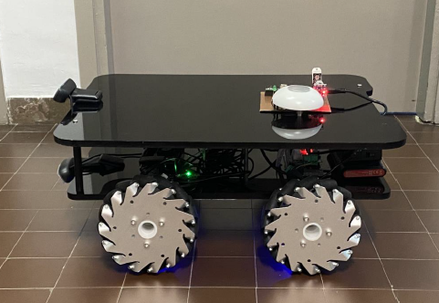
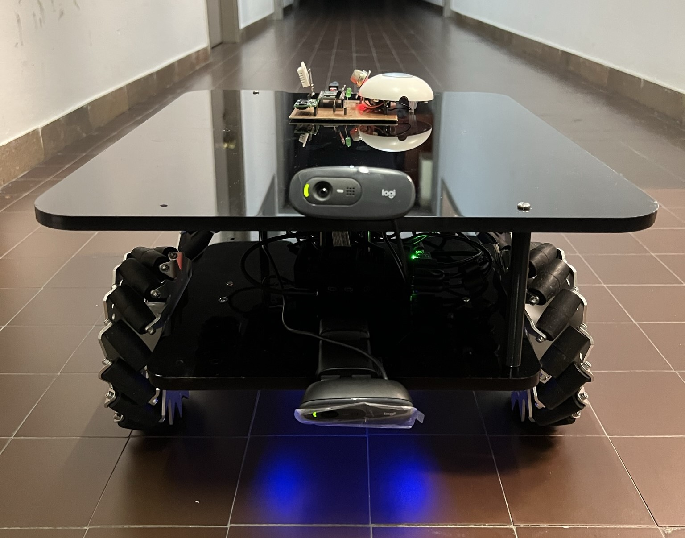
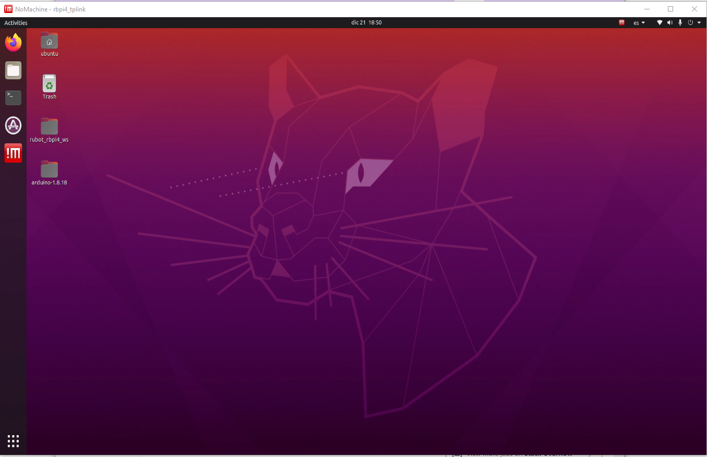

# **rUBot2.0 Line following & Signal identification**

We have designed and assembled a new custom mecanum robot rUBot2.0.

The mechanical structure is descrived below:



The platform of the rUBot 2.0 is larger and designed to be able to transport objects. The main difference with the rUBot 1.0 is that it consists of two Logitech C270 webcams, one that will be in charge of processing the images for line tracking and the other for signal detection. in the image below you can see the rubot 2.0 with the arrangement of its two webcams.

His main characteristics are: 
- Arduino based control for sensors & actuators
    - Servomotor actuators for the 4 mecanum wheels
- As onboard controll it's used RaspberryPi4 
    - RPlidar distance sensor
    - Two logitech C270 to capture the image and implement the line following and traffic sign detection

In this document we will describe:

- Bringup SW and HW
- Line follower
- Traffic signal identification
- Self-driving car


## **1. rUBot2.0 Bringup**

We will perform the bringup in virtual environment and in real robot

### **2.1 Bringup in virtual environment**
Now that we have everything installed, we can run our container. So launch Docker Desktop and go to Containers menu. Find the container that we created and press the Play button, in this example my container it's named as ROS1_Noetic_VNC.

After a few seconds we can click on the port 80:80 and it will open a browser with a localhost.

To compile the project you have to open a terminal in this folder and execute the following command:
```shell
cd /home/rUBot_mecanum_ws 
catkin_make 
```
Now let's modify the .bashrc file. Open a new folder and click on the View option in the top settings bar, then select the "Show Hidden" option. Now go to `/root/` and open the .bashrc file and add this code at the bottom:
```Bash
(...)
GAZEBO_MODEL_PATH=/home/rUBot_mecanum_ws/src/rubot_mecanum_description/models:$GAZEBO_MODEL_PATH
source /opt/ros/noetic/setup.bash
source /home/rUBot_mecanum_ws/devel/setup.bash
cd /home/rUBot_mecanum_ws
```
This way, every time we open a terminal, it will be located in our workspace.

To create a world in gazebo you first have to create the virtual world. In this case the model called "road_circle" has been used. 

Inside the road_circle folder there are two files and a folder:

- model.config: This is a configuration file used in Gazebo to describe the properties and metadata of a model. This file is used to provide information about the model and to configure its behaviour within the simulation environment
- model.sdf: is a Simulation Description Format (SDF) file used in Gazebo to describe the structure, physical properties, graphics and other attributes of a model.

Inside the "materials" folder there will be two more folders:

- Scripts folder: A file called road_circle.material is created. It is a configuration file used in Ogre, the rendering engine used by Gazebo, to define materials and shaders used in the visual representation of the objects in the simulation. The name "road_circle" refers to the name of the specific material file you are using.<br>
- Textures folder: A .png file is added with the texture we want to add.

Models have been created for:
- the ground (the circle for the line following) 
- and the various road signs.

In this project we have four different worlds in which we can emulate our rUBot. To choose which one we want to work on, there is a Python script that allows you to choose one of these three. To execute this script, open a terminal inside of rUBot_mecanum_ws and type the following command:

```shell
python world_select.py
```
You will see four options, then select select the one you want:

|1: road.world|2: road_left.world|3: road_right.world|4: road_stop.world|
|-------------|------------------|-------------------|------------------|
|||
|Perfect environment to test line following functionality|Perfect environment to test left signal detection. Same as the road.world but with a left signal|Perfect environment to test right signal detection. Same as the road.world but with a right signal|Perfect environment to test stop signal detection. Same as the road.world but with a stop signal|

To bingup rUBot2.0 in virtual environment we have to launch:
```shell
roslaunch rubot_mecanum_description rubot_bringup_sw.launch
```

At this point we have all ready to start testing in a simulated environment.

### **2.2 Bringup in Real environment**

To use the HW, you need to:
- Connect your computer with rUBot2.0 Access point and use NoMachine remote desktop.
<br>
- Now open a terminal in your workspace folder and type the following command:
```shell
roslaunch rubot_mecanum_description rubot_bringup_hw_rbpi.launch
```
The nodes and topics structure corresponds to the following picture:


## **3. rUBot2.0 Line Follower**

We will perform the bringup in virtual environment and in real robot

### **3.1 In Virtual environment**
We can simulate the line follower method to test if it's working as expected.

- First let's choose the world (Select the first world (empty world)), 
```shell
python world_select
```
- then open another terminal tab and type the following command:

```shell
roslaunch rubot_projects line_following.launch
```

The code implements a ROS node in Python that subscribes to the image message coming from the camera (/rubot/camera1/image_raw). The goal of the node is to follow a line in the image using image processing and proportional control techniques.

Below is a summary of the main parts of the code:

1. The necessary packages and modules are imported, including rospy for communication with ROS, numpy for numerical operations, cv2 for image processing using OpenCV and the necessary ROS messages (Image and Twist).

2. A class called camera_sub is defined to represent the ROS node. The constructor __init__ initialises the node, creates the necessary subscribers and publishers, and sets important variables.

3. The camera_cb method is the callback that is executed each time an image message is received from the camera. In this method, image processing is performed to detect the line.

    - The image is converted from ROS format to OpenCV format using cv_bridge.
    - The Canny operator is applied to obtain the edges of the image.
    - The white pixels in the region of interest are identified and their indices are stored in the white_index list.
    - The midpoint of the line is calculated from the white pixel indices.
    - The error is calculated as the difference between the position of the midpoint of the line and the desired position of the robot.
4. A proportional control is defined to adjust the angular velocity of the robot according to the error. If the line is detected (at least 2 white pixels), the angular velocity is calculated proportionally to the error. In addition, a constant linear velocity is set. If the line is not detected, the robot turns to the right and stops.

5. The velocity commands (Twist) are published in the /cmd_vel topic using the cmd_vel_pub publisher.

6. The original image and the processed image are displayed in separate windows using cv2.imshow.

7. The move method is used to keep the node running using rospy.spin().

8. In the if __name__ == '__main__': block, an instance of the camera_sub class is created, the move method is called and a KeyboardInterrupt exception is caught to properly terminate the node when Ctrl+C is pressed.

### **3.2 In real environment**

Open the code in file "line_following.py" to understand the designed process:

- The code implements a node that uses the two cameras to perform one-line tracking and traffic sign detection. 
- The node subscribes to image messages from the cameras (/usb_cam0/image_raw and /usb_cam1/image_raw) and publishes speed commands to the /cmd_vel topic to control the movement of a robot.
- A class called CameraSub is defined which represents the ROS node. The __init__ constructor initialises the node, creates the necessary subscribers and publishers, and loads a pre-trained traffic signal classification model and corresponding classes.
- The **line_cb** method is executed each time an image message is received from the line tracking camera. In this method, the image is processed to detect the line. The image is converted to OpenCV format, converted to HSV colour space and a mask is applied to detect yellow pixels, representative of the line. The error is then calculated as a function of the detected line position and the angular velocity of the robot is adjusted.
- The **sign_cb** method is executed each time an image message is received from the traffic sign detection camera. Signal detection is performed here using a pre-trained classification model. The image is processed and resized to match the format required by the model. Then, a prediction is made using the model and actions are taken based on the detected class, such as stop, left turn or right turn.
- Furthermore, additional methods are defined to adjust the speed commands according to the required actions, such as stop, turn left or turn right.
- Finally, the processed images are displayed in separate windows using OpenCV, and the rospy.spin() method is used to keep the node running.

- Now open a terminal in your workspace folder and type the following command:
```shell
roslaunch rubot_mecanum_description rubot_bringup_hw_rbpi.launch
roslaunch rubot_projects line_following_hw.launch
```

## **4. Traffic sign Identification**

For the signal identification part, the image recognition tool developed by Google, Teachable Machine based on Tensorflow, has been used. Here is the link to the official website:  [Teachable Machine](chat.openai.com/?model=text-davinci-002-render-sha/).<br>

For this purpose, a standard image project has been created and four different classes have been defined: Right, Left, STOP and Environment.
The environment class has been specially created so that when the robot does not detect any signal, it will follow the line.
Las imágenes usadas son las siguientes:
|1: LEFT|2: RIGHT|3: STOP|
|-------------|------------------|-------------------|
|||
|Left traffic sign|Right traffic sign|Stop traffic sign|

To capture images of the environment, simply take webcam samples of the environment where the rubot is going to move. <br>
the code used for signal identification combined with the line follower is as follows:

Signal detection is performed in the 'sign_cb' function and line tracking is performed in the 'line_cb' function. The execution flow of each is explained below:<br>

**Signal detection:**<br>
- In the 'sign_cb' function, an image is received from the camera and processed to prepare it for signal detection.
- The image is passed through a pre-trained neural network model to obtain a class prediction and confidence score for each class.
- The class with the highest confidence score is selected as the detected class.
- Depending on the detected class, specific actions are taken:
    - If the class is "STOP", the robot motion is stopped.
    - If the class is "LEFT", the robot is instructed to turn left.
    - If the class is "RIGHT", the robot is instructed to turn right.
    - If the class is "ENV", the line_cb function is called to perform line tracking.
- The processed image with the signal detections is displayed in a window.

**Line tracking:**<br>
- In the 'line_cb' function, an image is received from the camera and processed to detect a yellow line to be followed.
- The image is converted to HSV colour space and a mask is applied to isolate the yellow pixels.<br>
- White pixels are identified in the resulting mask.
- If at least two white pixels are detected, the midpoint of the line is calculated.
- The error is calculated as the difference between the position of the midpoint of the line and a reference position of the robot.
- Based on the error, the angular velocity of the robot is adjusted to keep it at the centre of the line.
- The updated velocity command is issued to control the movement of the robot.
- The processed images and masks are displayed in separate windows for visualisation. <br>

It is important to note that the effectiveness and accuracy of signal detection and line tracking depend on the quality of the input images, the models used and the processing parameters applied.

**ALTERNATIVE METHOD**<br>


Antoher method used to detect the signal in this code is the use of an OpenCV Haar cascade classifier.
```python
self.stop_cascade = cv2.CascadeClassifier('/home/ubuntu/rUBot_mecanum_ws/src/rubot_projects/src/stop_sign.xml')
```
The cascade classifier previously trained to detect STOP signals is loaded. Then, in the 'camera_cb' function, STOP signal detection is performed using this classifier:
```python
gray = cv2.cvtColor(frame, cv2.COLOR_BGR2GRAY)
stop_signs = self.stop_cascade.detectMultiScale(gray, 1.1, 5)
if len(stop_signs) > 0:
    print("Señal de STOP detectada")
    # Detener el robot
    self.vel_msg.linear.x = 0
    self.vel_msg.angular.z = 0
    self.cmd_vel_pub.publish(self.vel_msg)
    return
```
First, the camera frame is converted to greyscale using 'cv2.cvtColor'. Then, the 'detectMultiScale' function of the cascade classifier is used to search for the presence of the STOP sign in the grayscale image. If the STOP signal is detected (the length of 'stop_signs' is greater than 0), a message is printed, the robot is stopped and a zero speed message is posted in the '/cmd_vel' topic. <br>
You can find the STOP model on the following path: oborqueg/rUBot_mecanum_ws/Documentation/files/Models/stop_sign.xml